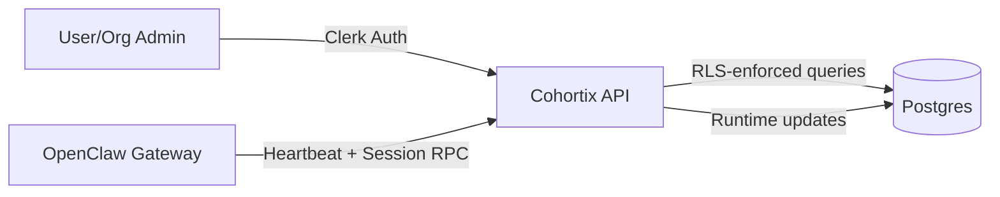
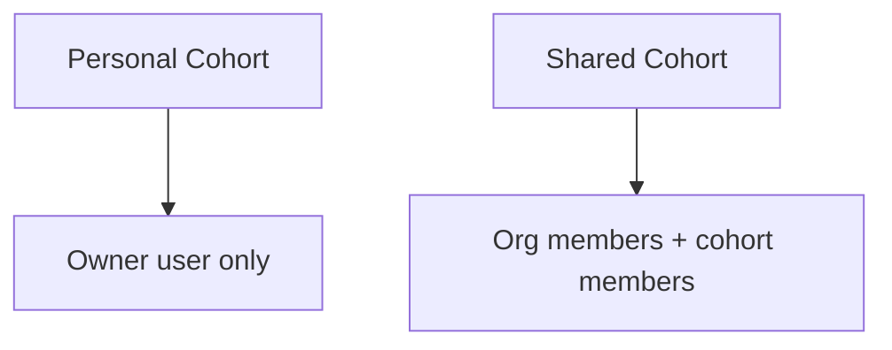
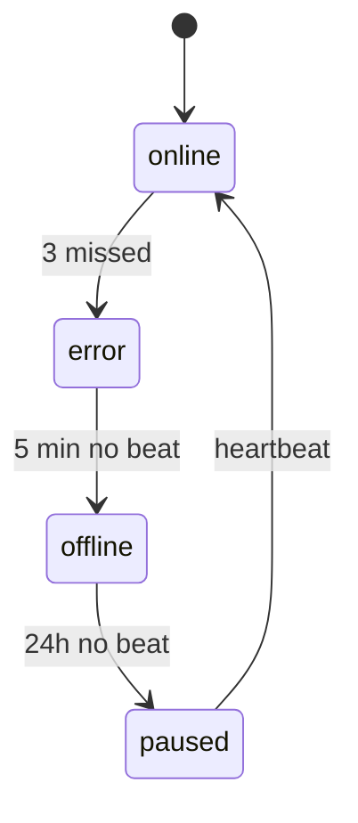

# Cohort Architecture Overview

## Summary
Cohortix provides **personal** and **shared** cohorts with strict scope isolation.
Runtime activity is powered by OpenClaw gateway instances that emit heartbeats
and run agent sessions. Data access is enforced by **RLS policies** in the
Postgres layer and validated in the API.

## System Components

- **Cohortix API (Next.js)**: CRUD for cohorts, members, agents, runtime state
- **Postgres + RLS**: data and policy enforcement for personal/cohort/org scope
- **OpenClaw Gateway**: runtime engine for heartbeats, sessions, and file access
- **Clerk**: user identity and organization membership

## High-Level Flow

## Cohort Types & Isolation

- **Personal cohort**: owned by a single user, invisible to org admins
- **Shared cohort**: scoped to an org; access granted via membership

## Runtime Lifecycle

Heartbeats are expected every 30 seconds. Status transitions:

## Security Model

1. **API auth** via Clerk for user/admin routes
2. **Gateway auth** via connection token (JWT) for runtime heartbeats
3. **RLS** enforces row-level visibility for personal/cohort/org scope

## Data Model (Key Tables)

- `cohorts` (type, hosting, runtime status)
- `cohort_user_members` / `cohort_agent_members`
- `agents` (personal/cohort/org scope)
- `task_sessions` (per-task runtime isolation)

## Operational Notes

- Connection tokens are 7-day JWTs, hashed in DB for audit/rotation.
- Heartbeat updates drive runtime status and gateway health dashboards.
- API routes enforce scope and membership before mutations.
