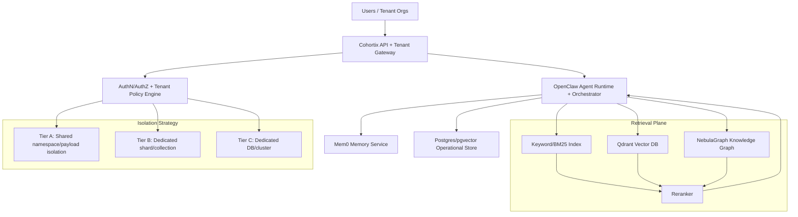

# Knowledge Infrastructure Research 2026 — Cohortix Agent Marketplace

**Date:** 2026-02-17  
**Prepared for:** Cohortix / Axon leadership  
**Scope:** Multi-tenant knowledge infra for agent marketplace + future
user-created agents and rentable cohorts

---

## Executive Summary (Clear Recommendation)

### Recommended 2026 Stack (pragmatic + scalable)

1. **Vector DB:** **Qdrant** (self-host first, optional managed later)
2. **Knowledge Graph:** **NebulaGraph** (primary), with **FalkorDB** as
   GraphRAG-first fast-follow candidate
3. **Agent Memory:** **Mem0** as default memory layer (keep), optionally pair
   with **LangMem** for LangGraph-native agent families
4. **Unified Retrieval:** Keep/upgrade QMD to **4-stage retrieval**: BM25 +
   dense vector + graph expansion + reranker
5. **Tenant Isolation Strategy:** **Tiered isolation model**
   - Starter tenants: namespace/payload isolation in shared clusters
   - Premium/regulated tenants: dedicated shard/DB
6. **Deployment:** **Docker Compose for MVP/Beta**, migrate to **Kubernetes**
   at >50–100 active tenant orgs or strict SLO/compliance demands

### Why this is best for Cohortix

- Lowest lock-in while remaining production-ready
- Aligns with existing local-first stack (OpenClaw + NeuroBits + Mem0 + QMD)
- Supports both current Axon-created agents and future marketplace creator
  economy
- Gives clear path from bootstrapped operation to enterprise-grade isolation

---

## 1) Vector DB for Multi-Tenant Agent Knowledge

| Option       | Multi-tenancy / Isolation                                                          | Scale & Performance                                       | Cost Profile                                           | Self-host vs Cloud   | Verdict                                      |
| ------------ | ---------------------------------------------------------------------------------- | --------------------------------------------------------- | ------------------------------------------------------ | -------------------- | -------------------------------------------- |
| **Qdrant**   | Strong via payload partitioning + shard-key strategy; tiered multitenancy features | High throughput, strong filtering                         | Very good for self-host; efficient infra usage         | Both                 | **Best fit**                                 |
| **Weaviate** | Native tenant-per-shard model, good tenant lifecycle                               | Strong for hybrid/vector workloads                        | Managed plans can rise faster with scale               | Both                 | Great #2                                     |
| **Milvus**   | Rich options: DB/collection/partition/partition-key tenancy                        | Excellent at large scale; more ops-heavy                  | Good at scale, higher operational complexity           | Both                 | Strong for larger infra teams                |
| **Pinecone** | Namespaces + projects; clean SaaS isolation patterns                               | Excellent managed scaling                                 | Higher floor ($50+ min standard, $500+ enterprise min) | Cloud-first          | Best managed choice, less bootstrap-friendly |
| **ChromaDB** | Basic isolation via DB/collection patterns; weaker enterprise tenancy controls     | Great for prototyping; limited at large multi-tenant prod | Cheap to start                                         | Both                 | Dev/prototype first                          |
| **pgvector** | Strong with Postgres RLS + partitioning patterns                                   | Good for moderate scale; tuning-heavy for high QPS ANN    | Very cost-effective if Postgres already central        | Self-host/managed PG | Great auxiliary store                        |

### Recommendation

- **Primary:** Qdrant for marketplace-scale tenant memory + semantic retrieval
- **Secondary:** pgvector for transactional joins and lower-scale tenant
  features

---

## 2) Knowledge Graph for Agent Expertise

| Option             | Graph + Vector/GraphRAG                                                          | Performance                                                          | Python Ecosystem     | Cost                                              | Verdict                           |
| ------------------ | -------------------------------------------------------------------------------- | -------------------------------------------------------------------- | -------------------- | ------------------------------------------------- | --------------------------------- |
| **NebulaGraph**    | Strong graph core; suitable for large knowledge graphs and GraphRAG patterns     | Very strong at large edge counts                                     | Solid (clients/SDKs) | OSS + infra cost only (self-host)                 | **Best balance for Cohortix**     |
| **Neo4j**          | Mature ecosystem; GraphRAG possible with tooling                                 | Strong but can be expensive at scale                                 | Excellent            | Aura pricing premium; enterprise licensing custom | Best maturity, higher TCO         |
| **FalkorDB**       | Very GraphRAG-friendly positioning; fast benchmarks in graph expansion workloads | Excellent latency claims                                             | Growing              | Managed plans available; enterprise custom        | Strong challenger (watch closely) |
| **Apache AGE**     | Graph on PostgreSQL (openCypher extension)                                       | Good if already PG-centric, less specialized than dedicated graph DB | Good via PG stack    | Low incremental cost                              | Good low-cost fallback            |
| **Amazon Neptune** | Managed graph + vector search features                                           | Strong managed performance                                           | Good AWS integration | Can get expensive; AWS lock-in                    | Best for AWS-native enterprise    |

### Recommendation

- **Primary now:** NebulaGraph
- **Pilot track:** FalkorDB for GraphRAG-heavy workloads and latency-sensitive
  retrieval

---

## 3) Agent Memory System (Evolution / Learning)

| Option           | Multi-agent isolation                                         | Dedup / Memory quality                             | Scalability            | Cost Model                     | Verdict                                      |
| ---------------- | ------------------------------------------------------------- | -------------------------------------------------- | ---------------------- | ------------------------------ | -------------------------------------------- |
| **Mem0**         | Workspace/project-level patterns; proven in agent stacks      | Strong memory extraction + dedup behavior          | Good                   | Free/Hobby to Pro + Enterprise | **Keep as core memory system**               |
| **Zep**          | Good cloud multi-project model                                | Strong temporal knowledge graph + context assembly | Strong managed scaling | Credit-based, cloud-oriented   | Great if you want managed temporal KG memory |
| **LangMem**      | Namespace control via LangGraph stores                        | Good but DIY architecture choices                  | Depends on your infra  | OSS (infra cost only)          | Great for LangGraph-native agent families    |
| **Letta/MemGPT** | Strong per-agent state model; shared-memory patterns possible | High potential for deep stateful agents            | Good with right infra  | Mixed (OSS + managed options)  | Great for advanced long-lived agent personas |
| **Custom**       | Maximum                                                       | Variable                                           | Variable               | Engineering-heavy              | Use only for differentiated moat layers      |

### Recommendation

- Keep **Mem0** as default memory substrate for marketplace reliability and
  speed
- Add **LangMem** only where LangGraph-native agents need tight in-workflow
  memory tools
- Evaluate **Zep** if temporal KG memory becomes a core requirement

---

## 4) Unified Search Layer (Vector + Graph + Keyword)

### Recommended retrieval pattern (v2 QMD)

1. **Lexical retrieval (BM25/keyword)** for exact constraints and sparse terms
2. **Dense vector retrieval** (Qdrant)
3. **Graph expansion/traversal** (NebulaGraph) over top entities/concepts
4. **Reranker** (cross-encoder/LLM rerank) for final top-k context

### Practical fusion strategy

- Candidate generation: parallel BM25 + vector
- Merge: Reciprocal Rank Fusion (RRF)
- Graph-aware expansion: add 1–2 hop subgraph neighbors for top entities
- Final rerank: relevance + tenant policy + recency score

### Why

- BM25 improves exact phrase and identifier recall
- Vector catches semantic similarity
- Graph traversal improves multi-hop reasoning and relationship-aware answers
- Reranker improves precision for generation context

---

## 5) Multi-Tenant Architecture Patterns

| Pattern                             | Isolation                       | Cost      | Ops Complexity | Best Use                                      |
| ----------------------------------- | ------------------------------- | --------- | -------------- | --------------------------------------------- |
| **Shared DB + tenant_id/namespace** | Medium (depends on enforcement) | Lowest    | Low            | SMB tenants, MVP                              |
| **Schema/collection per tenant**    | Medium-High                     | Medium    | Medium         | Mid-tier customers needing cleaner boundaries |
| **Database/shard per tenant**       | Highest                         | Highest   | High           | Enterprise/compliance-sensitive tenants       |
| **Hybrid tiered**                   | Flexible                        | Optimized | Medium-High    | **Best marketplace pattern**                  |

### Cohortix recommendation: Tiered Isolation

- **Tier A (default):** Shared infra + strict tenant filters
  (namespace/payload + auth policy)
- **Tier B (premium):** Dedicated shard/collection
- **Tier C (regulated/enterprise):** Dedicated DB/cluster + key isolation +
  audit

---

## 6) Infrastructure & Deployment

### Compose vs Kubernetes

| Stage                               | Recommended                      | Why                                                        |
| ----------------------------------- | -------------------------------- | ---------------------------------------------------------- |
| MVP / Early Beta                    | **Docker Compose**               | Fast setup, low ops burden, low cost                       |
| Growth (>50-100 active tenant orgs) | **Kubernetes**                   | Better scheduling, autoscaling, resilience, policy control |
| Enterprise/regulatory               | **Kubernetes + GitOps + policy** | Stronger isolation, auditability, SLO operations           |

### Bootstrapped monthly estimate (excluding LLM tokens)

#### Scenario A — Lean self-hosted (Compose, 10–30 active orgs)

- Qdrant self-host: $60–150
- NebulaGraph self-host: $80–200
- App/worker/message infra: $80–200
- Observability/logging/backups: $40–120
- **Total:** **~$260–670/mo**

#### Scenario B — Balanced growth (mixed managed, 30–100 orgs)

- Qdrant Cloud or larger self-host: $150–400
- NebulaGraph/Falkor managed or bigger cluster: $200–600
- Memory/queue/ops stack: $150–400
- Monitoring + backups + security: $100–250
- **Total:** **~$600–1,650/mo**

#### Scenario C — Enterprise-ready footprint

- Dedicated tenant isolation + HA + stronger compliance controls
- **Total infra (pre-LLM):** **~$2,000–6,000+/mo** depending on dedicated
  tenancy mix

---

## Recommended Target Architecture (Mermaid)

---

## Migration Path from Current Stack

### Current

OpenClaw + NeuroBits (Chroma + KG extraction) + Mem0 + QMD on local Mac Mini

### Phase 1 (2–4 weeks): Stabilize retrieval + tenancy

- Introduce Qdrant as primary vector backend
- Keep QMD, but add explicit tenant-aware RRF fusion
- Add hard tenant policy middleware (request-scoped tenant context)

### Phase 2 (4–8 weeks): Graph hardening

- Move KG from extraction-only mode to dedicated graph DB (NebulaGraph)
- Define graph schema for: agent, skill, source, mission, memory, evidence
- Add graph expansion step in retrieval

### Phase 3 (6–10 weeks): Tiered isolation rollout

- Launch Tier A/B isolation (shared + dedicated shard)
- Meter tenant usage (storage, QPS, memory writes)
- Add tenant migration tooling (A -> B -> C with minimal downtime)

### Phase 4 (8–12 weeks): Marketplace readiness

- Creator-owned agent knowledge spaces
- Cohort-level shared memory protocols (group policy + inheritance rules)
- Billing hooks for knowledge storage + retrieval + memory writes

---

## Risks & Mitigations

| Risk                                              | Impact   | Likelihood | Mitigation                                                                         |
| ------------------------------------------------- | -------- | ---------- | ---------------------------------------------------------------------------------- |
| Cross-tenant leakage due to filter bugs           | Critical | Medium     | Mandatory tenant context in gateway, policy tests, deny-by-default query wrappers  |
| Graph/model drift causing poor retrieval quality  | High     | Medium     | Retrieval eval harness, periodic relevance audits, fallback to lexical/vector-only |
| Ops overload from early Kubernetes adoption       | Medium   | High       | Start on Compose; move to K8s only with clear trigger thresholds                   |
| Cost spikes from unmanaged memory growth          | High     | Medium     | TTL/decay policies, summarization, memory budgets per tenant/agent                 |
| Vendor lock-in on managed services                | Medium   | Medium     | Prefer OSS-compatible APIs; keep migration playbooks                               |
| Inconsistent memory quality across agent builders | High     | Medium     | Standard memory schema, ingestion contracts, quality score gating                  |

---

## Final Decision

If Cohortix wants the **best 2026 balance of cost, control, and multi-tenant
scalability**, proceed with:

- **Qdrant + NebulaGraph + Mem0 + QMD(Upgraded Hybrid GraphRAG)**
- **Tiered tenant isolation architecture**
- **Compose-first, Kubernetes-later operational strategy**

This preserves your current velocity while unlocking the future marketplace
model (user-created agents and rentable cohorts) without an early infra
overbuild.

---

## Sources (selected)

- Qdrant multitenancy docs:
  https://qdrant.tech/documentation/guides/multitenancy/
- Qdrant tiered multitenancy release notes:
  https://qdrant.tech/blog/qdrant-1.16.x/
- Weaviate multi-tenancy docs:
  https://docs.weaviate.io/weaviate/manage-collections/multi-tenancy
- Milvus multi-tenancy docs: https://milvus.io/docs/multi_tenancy.md
- Pinecone pricing: https://www.pinecone.io/pricing/
- Chroma pricing: https://www.trychroma.com/pricing
- AWS Neptune pricing/features: https://aws.amazon.com/neptune/pricing/
- Apache AGE project/docs: https://age.apache.org ,
  https://github.com/apache/age
- LangMem repo/docs: https://github.com/langchain-ai/langmem
- Zep pricing: https://www.getzep.com/pricing/
- Mem0 pricing: https://mem0.ai/pricing
- Additional synthesis queries performed via Perplexity Sonar web search
  (2025–2026)
