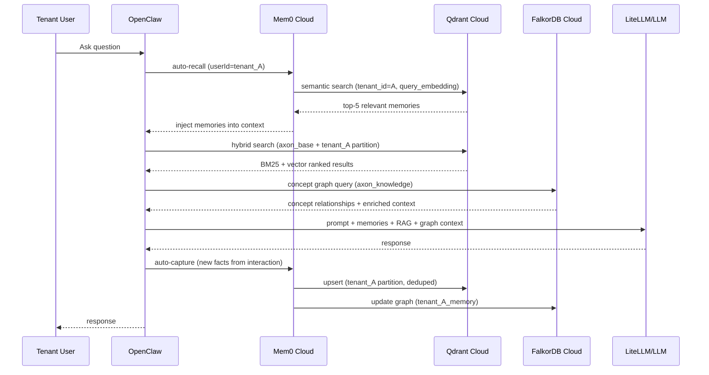

# Cohortix Knowledge Infrastructure Research

## Deep-Dive: Best Stack for a Multi-Tenant AI Agent Marketplace

**Date:** 2026-02-17  
**Researched by:** Devi (AI Developer Specialist)  
**Purpose:** Drive infrastructure decision for Cohortix knowledge layer  
**Prior Art:** See `V3-TECH-STACK-RESEARCH.md` (v3 runtime stack — this doc
focuses specificagent on **knowledge storage, graph, and memory**)

---

## Table of Contents

1. [Executive Summary](#1-executive-summary)
2. [Context: What Cohortix Actuagent Needs](#2-context-what-cohortix-actuagent-needs)
3. [Vector DB Comparison — Multi-Tenant Agent Memory](#3-vector-db-comparison)
4. [Knowledge Graph Comparison — Agent Expertise](#4-knowledge-graph-comparison)
5. [Agent Memory Layer — Dedicated vs. DIY](#5-agent-memory-layer)
6. [Agent Marketplace Platforms — What Exists](#6-agent-marketplace-platforms)
7. [OpenClaw Integration Patterns](#7-openclaw-integration)
8. [Converged Solutions — All-in-One Options](#8-converged-solutions)
9. [Cost Analysis at Scale](#9-cost-analysis)
10. [Recommended Stack](#10-recommended-stack)
11. [Alternative Stacks](#11-alternative-stacks)
12. [Migration Path](#12-migration-path)
13. [Architecture Diagram](#13-architecture-diagram)

---

## 1. Executive Summary

**The core challenge:** Cohortix must store, retrieve, and isolate knowledge for
hundreds to thousands of agent tenants — across both Axon-built agents (CMO,
Developer, Designer) and user-created agents — while enabling fast semantic
search and rich concept-relationship querying.

**Key Findings:**

| Decision              | Winner               | Runner-Up           | Why                                                                                          |
| --------------------- | -------------------- | ------------------- | -------------------------------------------------------------------------------------------- |
| **Vector DB**         | **Qdrant Cloud**     | Weaviate Cloud      | Best multi-tenancy (Tiered Multitenancy v1.16), lowest cost/QPS, hybrid BM25+vector built-in |
| **Knowledge Graph**   | **FalkorDB Cloud**   | Neo4j Aura          | 496x faster than Neo4j, built-in GraphRAG SDK, 10K+ multi-tenant graphs, Cypher-compatible   |
| **Memory Layer**      | **Mem0 Cloud (Pro)** | Custom Qdrant       | Native OpenClaw plugin, dedup, graph memory, 80% token compression                           |
| **Converged Option**  | **Weaviate**         | Neo4j AuraDB        | Built-in hybrid search + cross-reference graph-like refs + multi-tenancy in one product      |
| **Agent Marketplace** | **Build custom**     | Fetch.ai Agentverse | No existing platform meets Cohortix's agent-cohort model; borrow patterns from Agentverse    |

**Recommended Stack (Primary):**

```
Qdrant Cloud          → Agent vector memory, RAG, hybrid search
FalkorDB Cloud        → Knowledge graph (concept relationships, GraphRAG)
Mem0 Cloud (Pro)      → OpenClaw agent memory layer (bridging local ↔ cloud)
Supabase (existing)   → Relational, auth, RLS tenant isolation, basic pgvector
```

**Estimated Cost:** $540–$1,050/month at 100 tenants; $2,600–$4,500/month at
1,000 tenants

---

## 2. Context: What Cohortix Actuagent Needs

### 2.1 Platform Architecture

```
Cohortix Platform
├── Axon Agents (pre-built, specialized)
│   ├── CMO Agent  → marketing domain knowledge
│   ├── Developer Agent → engineering knowledge
│   └── Designer Agent → design/brand knowledge
│
├── User-Rented Agents (user hires Axon agent)
│   └── User gets isolated context, not the agent's full knowledge base
│
├── User-Created Agents (future)
│   └── User builds their own agent, rents it to others
│
└── Agent Cohorts (future)
    └── Renting groups of agents as a "protocol system" (like Axon Codex)
```

### 2.2 Knowledge Dimensions

Each agent has **three distinct knowledge types** that need different storage:

| Knowledge Type       | Description                                   | Storage Need                 |
| -------------------- | --------------------------------------------- | ---------------------------- |
| **Domain Knowledge** | Courses, expertise, fundamentals (read-heavy) | Vector DB + Knowledge Graph  |
| **Episodic Memory**  | Past interactions with this tenant's users    | Tenant-isolated vector store |
| **Working Memory**   | Current session context, evolving facts       | In-memory + vector DB        |

### 2.3 Multi-Tenancy Requirements

```
Tenant = A Cohortix "customer" (individual or company)
├── Tenant hires CMO Agent → gets their OWN episodic memory space
├── Tenant's session data never leaks to other tenants
├── Axon's core domain knowledge is SHARED across tenants (read-only)
└── Tenant-created agents have full ownership of their knowledge
```

**Key isolation requirement:** Axon's base knowledge (NeuroBits, expertise/)
must be accessible to all agents BUT tenant episodic/working memory must be
strictly isolated per tenant.

### 2.4 Current Local Stack Limitations

| Component           | Current                            | Limitation                                |
| ------------------- | ---------------------------------- | ----------------------------------------- |
| **NeuroBits**       | ChromaDB + OpenAI graph extraction | Local only, not cloud-accessible          |
| **Mem0**            | Local agent memory                 | No cross-device sync, no tenant isolation |
| **QMD**             | BM25 + vector + reranker           | Local only, can't serve cloud agents      |
| **All on Mac Mini** | Single point of failure            | Not production-grade, no HA               |

---

## 3. Vector DB Comparison

### 3.1 Feature Matrix

| Feature                    | **Qdrant Cloud**                             | **Pinecone**                        | **Weaviate Cloud**                                       | **Supabase pgvector**                     | **Zilliz (Milvus)**               | **Chroma Cloud**                           |
| -------------------------- | -------------------------------------------- | ----------------------------------- | -------------------------------------------------------- | ----------------------------------------- | --------------------------------- | ------------------------------------------ |
| **Multi-tenancy**          | ✅ Tiered (v1.16): shared+dedicated shards   | ✅ Namespaces (unlimited Standard+) | ✅ Per-tenant shard isolation, ACTIVE/INACTIVE/OFFLOADED | ✅ RLS row-level policies                 | ✅ Partitions (100K+ collections) | ⚠️ Enterprise only: single-tenant clusters |
| **Hybrid Search**          | ✅ BM25 sparse + dense + fusion              | ✅ Dense + sparse                   | ✅ Native BM25 + vector                                  | ⚠️ pgvector only; BM25 via pg_trgm or FTS | ✅ Sparse-dense fusion            | ✅ Full-text + vector                      |
| **Metadata Filtering**     | ✅ Rich payload filters, indexed             | ✅ Metadata filtering               | ✅ GraphQL + filters                                     | ✅ SQL WHERE clauses                      | ✅ Scalar + vector filtering      | ✅ Metadata filters                        |
| **Latency (P95, 1M vecs)** | 30–40ms                                      | 7–50ms                              | 50–70ms                                                  | ~50ms (with index)                        | 50–80ms                           | ~60ms                                      |
| **QPS**                    | 8,000–15,000                                 | High (serverless)                   | 3,000–8,000                                              | ~471 QPS (pgvectorscale)                  | 10,000–20,000                     | Moderate                                   |
| **Self-host option**       | ✅ Open-source                               | ❌ Managed only                     | ✅ Open-source                                           | ✅ (Postgres)                             | ✅ Open-source                    | ✅ Open-source                             |
| **Knowledge Graph**        | ❌                                           | ❌                                  | ⚠️ Cross-refs only                                       | ❌                                        | ❌                                | ❌                                         |
| **OpenClaw Plugin**        | ✅ via Mem0 OSS                              | ⚠️ via Mem0                         | ⚠️ via Mem0                                              | ✅ (existing)                             | ⚠️ via Mem0                       | ⚠️ community                               |
| **Tiered Multitenancy**    | ✅ Promote large tenants to dedicated shards | ❌                                  | ✅ Offload inactive tenants to cold storage              | N/A (RLS handles this)                    | ✅ Partitions                     | ❌                                         |

### 3.2 Multi-Tenancy Deep Dive

#### Qdrant: Tiered Multitenancy (v1.16, Nov 2025)

- **Approach:** One collection per embedding model, partition by `tenant_id`
  payload key
- **Innovation:** "Tiered" means small tenants share a global shard; large
  tenants get **promoted to dedicated shards** automaticagent (no reindexing, no
  downtime)
- **Benefit at 1000 tenants:** 980 small tenants share infra; 20 large ones get
  dedicated resources. Eliminates "noisy neighbor" problem
- **Isolation mechanism:** Payload filter queries enforce `tenant_id` access
  scoping

#### Weaviate: Physical Shard Isolation

- **Approach:** Each tenant literagent gets its own shard (bucket of vectors,
  indexes, metadata)
- **Innovation:** ACTIVE/INACTIVE/OFFLOADED states — inactive tenants' memory is
  freed, offloaded ones go to cold storage. Supports **millions of tenants** per
  cluster
- **Benefit at 1000 tenants:** Inactive tenants cost near-zero. Perfect for
  Cohortix where most tenants may be low-activity
- **Limitation:** Higher base cost than Qdrant for active tenants

#### Supabase pgvector: RLS-Based Isolation

- **Approach:** Row-Level Security policies filter by `tenant_id`; one table,
  many tenants
- **Limitation:** ~471 QPS max (even with pgvectorscale), not suitable as
  primary vector store at scale
- **Best use:** Keep for relational data and light vector operations (already in
  stack)

### 3.3 Pricing Comparison

#### At 10 Tenants (~1M total vectors)

| DB                    | Monthly Cost  | Notes                                       |
| --------------------- | ------------- | ------------------------------------------- |
| **Qdrant Cloud**      | ~$30–$50      | Free tier (1GB), then minimal usage billing |
| **Pinecone Standard** | $50 (minimum) | Minimum commitment                          |
| **Weaviate Flex**     | $45 (minimum) | Pay-as-you-go minimum                       |
| **Supabase Pro**      | $25 + compute | Already paying; pgvector included           |
| **Zilliz Cloud**      | ~$20–$50      | Free 2.5M vCUs/month                        |
| **Chroma Cloud**      | ~$0 (Starter) | Community-supported                         |

#### At 100 Tenants (~10M total vectors)

| DB                    | Monthly Cost | Notes                           |
| --------------------- | ------------ | ------------------------------- |
| **Qdrant Cloud**      | ~$120–$250   | 2–4 vCPU/4–8GB RAM cluster      |
| **Pinecone Standard** | ~$200–$400   | Storage + RU costs              |
| **Weaviate Plus**     | ~$280+       | Plus tier, shared cloud         |
| **Supabase Pro**      | ~$200–$400   | Compute add-on for vector scale |
| **Zilliz Cloud**      | ~$100–$200   | Serverless PAYG                 |
| **Chroma Cloud Team** | ~$250 base   | + usage overage                 |

#### At 1000 Tenants (~100M total vectors)

| DB                      | Monthly Cost      | Notes                                  |
| ----------------------- | ----------------- | -------------------------------------- |
| **Qdrant Cloud**        | ~$500–$1,000      | Hybrid Cloud or large managed cluster  |
| **Pinecone Standard**   | ~$1,500–$2,500    | High RU count, storage                 |
| **Weaviate Dedicated**  | Custom (~$1,000+) | Dedicated cluster                      |
| **Supabase Enterprise** | Custom            | Not ideal at this scale                |
| **Zilliz Cloud**        | ~$500–$1,200      | Tiered storage discounts post-Jan 2026 |
| **Chroma Enterprise**   | Custom            | Single-tenant cluster                  |

### 3.4 Verdict: Vector DB

**🏆 Winner: Qdrant Cloud**

**Reasons:**

1. **Tiered Multitenancy (v1.16)** is purpose-built for exactly Cohortix's
   problem — many small tenants, few large ones
2. **Lowest cost/QPS ratio** in 2025 benchmarks (30–40ms P95, 8–15K QPS)
3. **Best hybrid search** — native BM25 sparse + dense + fusion (matches our QMD
   3-layer approach)
4. **OpenClaw integration** — direct via Mem0 OSS plugin
   (`vectorStore: { provider: "qdrant" }`)
5. **Self-host → cloud path** — Same API, migrate seamlessly
6. **Free tier** — 1GB forever for dev/staging

**Runner-up: Weaviate Cloud** — Best if you need converged vector+graph-like
references or inactive tenant cost optimization.

---

## 4. Knowledge Graph Comparison

### 4.1 Feature Matrix

| Feature              | **FalkorDB Cloud**                   | **Neo4j Aura**           | **NebulaGraph Cloud**   | **ArangoDB**                | **Amazon Neptune**  |
| -------------------- | ------------------------------------ | ------------------------ | ----------------------- | --------------------------- | ------------------- |
| **GraphRAG**         | ✅ Built-in GraphRAG-SDK             | ❌ Custom setup          | ⚠️ Community tools      | ⚠️ Via ArangoDB AI Platform | ❌ Custom           |
| **Vector Search**    | ✅ Native (hybrid BM25+graph+vector) | ✅ AuraDB vector index   | ⚠️ Limited              | ✅ Arango AI Data Platform  | ⚠️ Limited          |
| **Multi-tenancy**    | ✅ 10K+ multi-graphs                 | ⚠️ Limited               | ✅ Multi-tenant managed | ✅ RBAC/SSO                 | ⚠️ IAM-based        |
| **Cypher/GQL**       | ✅ Cypher-compatible                 | ✅ Cypher (native)       | ✅ nGQL (Cypher-like)   | ❌ AQL                      | ✅ Gremlin + SPARQL |
| **Latency (P99)**    | <140ms                               | 46.9s (!!)               | ~50–200ms               | ~100ms                      | ~100–500ms          |
| **Open-Source**      | ✅ AGPLv3                            | ⚠️ Community edition     | ✅ Apache 2.0           | ✅ Community (100GB limit)  | ❌ AWS only         |
| **Managed Cloud**    | ✅ FalkorDB Cloud                    | ✅ Neo4j Aura            | ✅ NebulaGraph Cloud    | ✅ AMP on AWS/GCP           | ✅ AWS Neptune      |
| **LLM Integrations** | ✅ LangChain, LlamaIndex             | ✅ LangChain, LlamaIndex | ⚠️ Growing              | ⚠️ Growing                  | ❌ Limited          |

### 4.2 Performance Deep Dive

#### FalkorDB vs Neo4j (Benchmarks, 2025)

From official benchmarks (FalkorDB vs Neo4j, Diffbot KG-LM dataset):

- **FalkorDB P99 latency:** <140ms
- **Neo4j P90 latency:** 46.9 seconds (!!)
- **FalkorDB memory efficiency:** 6x better than Neo4j
- **GraphRAG accuracy:** 3x better than pure vector RAG (FalkorDB benchmark)
- **Architecture advantage:** FalkorDB uses sparse adjacency matrices + AVX CPU
  acceleration (496x faster in specific traversals)

#### Why Neo4j Is Not Recommended

Despite being the "industry standard," Neo4j has serious issues for Cohortix's
use case:

1. Expensive licensing ($65/month for Professional, $259+/month for Enterprise)
2. Single-master write bottleneck (no horizontal write scaling)
3. No native GraphRAG support (requires custom integration)
4. 46.9s P90 latency in 2025 benchmarks vs FalkorDB's <140ms

### 4.3 Knowledge Graph Pricing

| Service                     | Pricing                            | Notes                                   |
| --------------------------- | ---------------------------------- | --------------------------------------- |
| **FalkorDB Cloud FREE**     | $0                                 | Dev, multi-graph support, limited scale |
| **FalkorDB STARTUP**        | $73/GB/month                       | HA, multi-zone, backups                 |
| **FalkorDB PRO**            | $350/8GB/month                     | 24/7 support, dedicated account manager |
| **Neo4j Aura Professional** | $65/month                          | Limited scale, no GraphRAG              |
| **Neo4j Aura Enterprise**   | $259+/month                        | Still slow, expensive                   |
| **NebulaGraph Cloud**       | ~$0.001/unit PAYG                  | Relatively cheap but less mature        |
| **ArangoDB AMP**            | Custom (starts ~$0.001–$0.009/hr)  | Multi-model but complex                 |
| **Amazon Neptune**          | $0.348/hr (db.r5.large) = ~$252/mo | Expensive, AWS lock-in                  |

### 4.4 Can a Graph DB Replace the Vector DB? (Converged)

| Approach                     | Product                             | Verdict                                      |
| ---------------------------- | ----------------------------------- | -------------------------------------------- |
| **Graph + Vector**           | FalkorDB (hybrid BM25+graph+vector) | ✅ Closest to converged for knowledge graphs |
| **Vector + Graph-like refs** | Weaviate (cross-references + ANN)   | ✅ Works for simple relationship modeling    |
| **Graph + Vector index**     | Neo4j AuraDB (vector index added)   | ⚠️ Vector is bolted on, not native           |
| **True multi-model**         | ArangoDB AI Data Platform           | ⚠️ Custom pricing, complex                   |

**Conclusion:** No single product is a perfect drop-in for both. The best
"converged" option is **FalkorDB for knowledge graphs + vector** or **Weaviate
for vector + light graph refs**. For Cohortix's needs, a two-component approach
(Qdrant for vector + FalkorDB for graph) gives the best performance.

### 4.5 Verdict: Knowledge Graph

**🏆 Winner: FalkorDB Cloud**

**Reasons:**

1. **496x faster** than Neo4j in graph traversal benchmarks
2. **Built-in GraphRAG-SDK** — no custom glue code needed
3. **10K+ multi-tenant graphs** — natively handles one graph per tenant
4. **Hybrid search** — BM25 + vector similarity + graph traversal in a single
   query
5. **Cypher-compatible** — can reuse Neo4j queries
6. **Cheaper** — $73/GB vs Neo4j's $259+/month for similar scale
7. **LangChain + LlamaIndex integrations** — works with our agent frameworks

**Runner-up: NebulaGraph Cloud** — If you need proven distributed scale
(trillions of edges), NebulaGraph is more battle-tested at massive scale but
lacks FalkorDB's GraphRAG capabilities.

---

## 5. Agent Memory Layer

### 5.1 The Question: Do We Need a Dedicated Memory Layer?

**Short answer: Yes, for Cohortix.** Here's why:

A raw vector DB (like Qdrant) can store embeddings, but agent memory is more
complex:

- **Deduplication** — Don't store the same fact 100 times
- **Fact evolution** — "User prefers X" → supersedes → "User now prefers Y"
- **Structured recall** — Inject relevant memories into LLM context
  automaticagent
- **Multi-scope** — Separate user memories, session memories, agent knowledge
- **Compression** — Reduce token overhead (up to 80% reduction)

Without a dedicated memory layer, you'd need to build all this yourself on top
of Qdrant.

### 5.2 Memory Layer Comparison

| Feature                 | **Mem0 Cloud (Pro)**                           | **Zep Cloud**                          | **LangMem**              | **Custom (Qdrant + metadata)** |
| ----------------------- | ---------------------------------------------- | -------------------------------------- | ------------------------ | ------------------------------ |
| **Auto-dedup**          | ✅ Core feature                                | ✅ Temporal graph                      | ⚠️ Background extraction | ❌ Must build                  |
| **Fact evolution**      | ✅ Updates + merges                            | ✅ Bi-temporal (invalidates old facts) | ✅ Background updates    | ❌ Must build                  |
| **Multi-agent scoping** | ✅ user/session/agent/project keys             | ✅ Session-based                       | ✅ Custom namespaces     | ✅ Payload filters             |
| **Multi-tenant**        | ✅ Unlimited end users (all tiers)             | ✅ Enterprise                          | ✅ Via namespaces        | ✅ Via Qdrant payload          |
| **Graph memory**        | ✅ Pro tier (entities + relationships)         | ✅ Core (temporal KG)                  | ❌                       | ❌                             |
| **OpenClaw Plugin**     | ✅ **Official plugin** (`@mem0/openclaw-mem0`) | ❌                                     | ❌                       | ⚠️ Via Mem0 OSS                |
| **Self-host**           | ✅ OSS version                                 | ❌ Cloud only                          | ✅ Library               | ✅                             |
| **Compression**         | ✅ Up to 80% token reduction                   | ✅ Context assembly                    | ✅                       | ❌                             |
| **LangChain/CrewAI**    | ✅                                             | ✅                                     | ✅ Native                | ✅                             |
| **LOCOMO benchmark**    | 67.13 J-score                                  | N/A                                    | 62.23 J-score            | N/A                            |

### 5.3 Pricing Comparison

| Plan            | Mem0                                    | Zep                                    | LangMem                |
| --------------- | --------------------------------------- | -------------------------------------- | ---------------------- |
| **Free**        | 10K memories, 1K calls/mo               | Open-source OSS                        | Free (library)         |
| **Starter/Dev** | $19/mo (50K memories, 5K calls)         | Flex: 20K credits then $25/20K         | Free (infra cost only) |
| **Production**  | $249/mo (unlimited memories, 50K calls) | Flex Plus: 300K credits then $125/100K | Free (infra cost only) |
| **Enterprise**  | Custom (SSO, audit, SLAs)               | Custom (multi-tenant, compliance)      | N/A                    |

**Cost at scale (1000 tenants):**

- **Mem0 Cloud Pro:** $249/month flat (unlimited memories, 50K calls — likely
  needs Enterprise for 1000 tenants at scale)
- **Zep Enterprise:** Custom pricing
- **LangMem:** Infrastructure cost only ($100–500/month for Qdrant/Postgres
  backing)

### 5.4 The OpenClaw Bridge — Critical for Cohortix

This is the **most important discovery** for Cohortix:

```
OpenClaw (local agent runtime)
       ↓ Mem0 plugin (`@mem0/openclaw-mem0`)
Mem0 Cloud ←→ Qdrant Cloud (vector store)
               ↑
         Cohortix Cloud Knowledge
```

**How it works:**

1. User runs OpenClaw locagent (our current setup)
2. Mem0 plugin is installed and configured with Cohortix's cloud Mem0 instance
3. Every agent session auto-captures facts → synced to Cohortix's cloud Qdrant
4. Every response auto-recalls relevant memories → from cloud knowledge base
5. Axon's domain knowledge lives in cloud; tenant episodic memory stays isolated
   by `userId`

**This is exactly the sync pattern we need:** Users don't need to manage cloud
infrastructure — Mem0 handles it transparently.

### 5.5 Verdict: Memory Layer

**🏆 Winner: Mem0 Cloud (Pro) + OSS for OpenClaw integration**

**Reasons:**

1. **Only framework with official OpenClaw plugin** — zero integration friction
2. **80% token compression** — critical for cost control at scale
3. **Graph memory in Pro** — entities + relationships without separate graph DB
   for memory
4. **Unlimited end users** — all Cohortix tenants under one Pro account
5. **26% better accuracy than OpenAI native memory** (LOCOMO benchmark)
6. **Multi-scope** — separate user, session, agent, and project memory
   namespaces
7. **Best of both worlds** — cloud managed with self-host option

---

## 6. Agent Marketplace Platforms

### 6.1 What Exists Today

| Platform                  | Model                                          | Knowledge Sharing               | Agent Cohorts                | Rental Model                            |
| ------------------------- | ---------------------------------------------- | ------------------------------- | ---------------------------- | --------------------------------------- |
| **CrewAI Enterprise**     | Submit pre-built "crews" (Q2 2025 Marketplace) | Via crew templates/configs      | ✅ Crews = agent teams       | No direct rental; deploy via Enterprise |
| **Fetch.ai Agentverse**   | Open decentralized marketplace                 | Via ASI:One LLM + agent READMEs | ⚠️ Limited cohort concept    | ✅ Monetize via micro-agent usage       |
| **Salesforce Agentforce** | Low-code builder + marketplace                 | Via Data Cloud integration      | ⚠️ Sequential agents         | Enterprise SaaS ($1,600+/mo)            |
| **Moveworks**             | Enterprise IT/HR agent marketplace             | Via knowledge base ingestion    | ❌ Single-purpose agents     | Subscription per workflow               |
| **LangGraph Cloud**       | LangGraph deployment platform                  | Via LangSmith + LangGraph state | ⚠️ Workflows only            | No marketplace                          |
| **AutoGen Studio**        | Visual agent builder (Microsoft)               | Via agent config files          | ✅ Multi-agent conversations | No marketplace                          |
| **Beam AI**               | Plug-and-play agent catalog                    | Pre-built connectors            | ❌                           | Subscription                            |

### 6.2 Knowledge Sharing Patterns

**How existing platforms handle agent creator → renter knowledge transfer:**

#### Pattern 1: Template-Based (CrewAI, AutoGen)

```
Creator → Defines crew/agent as config template
Renter → Deploys template, brings own data/context
Knowledge isolation: Creator's training ≠ renter's runtime data
```

- **Problem for Cohortix:** Can't package Axon's accumulated domain knowledge as
  "template" — it's in vector DBs, not configs

#### Pattern 2: Marketplace API (Fetch.ai Agentverse)

```
Creator → Registers agent with README + capabilities
Renter → Calls agent API (pay-per-call via ASI tokens)
Knowledge isolation: Each agent has its own execution environment
```

- **Closest to Cohortix's model** for agent-as-a-service but lacks the "domain
  expertise accumulated over time" component

#### Pattern 3: Shared Knowledge Base + Isolated Sessions (Cohortix's target)

```
Axon → Maintains domain knowledge (courses, expertise, daily evolution)
         Stored in: Qdrant (vectors) + FalkorDB (knowledge graph)
Tenant → Gets isolated session memory + access to base domain knowledge
         Their data: Qdrant namespace/tenant_id partition
         Base knowledge: Read-only shared collection
```

### 6.3 Agent Cohort Rental — What We Need to Build

No existing platform handles "rent a group of agents following a protocol
system." This is novel. Cohortix needs to design this pattern:

```
Cohort = {
  agents: [CMO, Developer, Designer, Project Manager],
  protocol: AxonCodex v1.2,
  knowledge: shared Qdrant collection + shared FalkorDB graph
  session: tenant-isolated memory namespaces
}

Rental model:
  Tenant pays → Gets a Cohort instance
  Cohort instance: isolated Mem0 namespace + Qdrant tenant partition
  Base knowledge: read-only access to Axon's shared collections
```

### 6.4 Knowledge Isolation Architecture for Marketplace

```
┌─────────────────────────────────────────────────────────┐
│                   AXON BASE KNOWLEDGE                    │
│  Qdrant: collection="axon_base", read-only              │
│  FalkorDB: graph="axon_knowledge", read-only            │
│  Mem0: agentId="axon_*", shared across tenants          │
└────────────────────────────┬────────────────────────────┘
                             │ read-only access
          ┌──────────────────┼──────────────────┐
          │                  │                  │
┌─────────▼──────┐  ┌────────▼───────┐  ┌──────▼──────────┐
│ Tenant A        │  │ Tenant B        │  │ Tenant C         │
│ Qdrant:         │  │ Qdrant:         │  │ Qdrant:          │
│  tenant_id="A"  │  │  tenant_id="B"  │  │  tenant_id="C"   │
│ Mem0:           │  │ Mem0:           │  │ Mem0:            │
│  userId="A"     │  │  userId="B"     │  │  userId="C"      │
│ FalkorDB:       │  │ FalkorDB:       │  │ FalkorDB:        │
│  graph="A_mem"  │  │  graph="B_mem"  │  │  graph="C_mem"   │
└─────────────────┘  └─────────────────┘  └──────────────────┘
```

---

## 7. OpenClaw Integration

### 7.1 Memory Backend Architecture in OpenClaw

OpenClaw supports pluggable memory backends via `openclaw.json`:

```
Default: QMD (local BM25 + vector over Markdown files)
Plugin: Mem0 (cloud or self-hosted)
Plugin: Neutron (cloud API)
Custom: Any Mem0-compatible vector store (Qdrant, Chroma, pgvector, Milvus, Pinecone)
```

### 7.2 Cohortix Cloud → OpenClaw Integration Pattern

The cleanest approach uses Mem0 as the bridge layer:

```json
// openclaw.json for Cohortix-powered agents
{
  "plugins": {
    "entries": {
      "openclaw-mem0": {
        "enabled": true,
        "config": {
          "mode": "open-source",
          "userId": "{{COHORTIX_TENANT_ID}}",
          "oss": {
            "embedder": {
              "provider": "openai",
              "config": { "model": "text-embedding-3-small" }
            },
            "vectorStore": {
              "provider": "qdrant",
              "config": {
                "host": "cohortix-qdrant.cloud",
                "port": 6333,
                "collection_name": "agent_memory"
              }
            },
            "graphStore": {
              "provider": "falkordb",
              "config": { "url": "cohortix-falkordb.cloud:6379" }
            },
            "llm": {
              "provider": "openai",
              "config": { "model": "gpt-4o-mini" }
            }
          }
        }
      }
    }
  }
}
```

**How this works for Cohortix:**

1. Cohortix issues tenant-scoped credentials (Qdrant API key + FalkorDB
   connection)
2. OpenClaw Mem0 plugin uses these credentials
3. All memory automaticagent flows to Cohortix's cloud infrastructure
4. Tenant isolation enforced by Qdrant `payload.tenant_id` + FalkorDB graph
   scoping
5. Axon's base knowledge accessible via separate read-only collection/graph

### 7.3 Sync Pattern: Push vs. Cloud-Native

**Option A: Push from Local → Cloud (Current-to-Cloud Migration)**

```
OpenClaw local QMD → periodic sync → Cohortix Cloud Qdrant
Advantage: Gradual migration, works offline
Disadvantage: Sync lag, conflict resolution complexity
```

**Option B: Cloud-Native from Day One (Recommended for new tenants)**

```
OpenClaw → Mem0 plugin → Cohortix Cloud directly
Advantage: No sync lag, no conflicts, single source of truth
Disadvantage: Requires internet connection
```

**Option C: Hybrid (Recommended for Axon internal agents)**

```
Local QMD (fast, offline-capable) + Cloud Mem0 (persistent, shared)
OpenClaw runs QMD locagent for speed
Background sync: local embeddings → cloud Qdrant every 5 minutes
Advantage: Offline-capable + cloud persistence
Implementation: Mem0 OSS with Qdrant cloud endpoint
```

**Verdict: Option B for Cohortix users; Option C for Axon's internal agents**

### 7.4 OpenClaw Version Compatibility Note

The Mem0 OpenClaw plugin (`@mem0/openclaw-mem0`) is **officiagent maintained**
and confirmed to support:

- Cloud mode (Mem0 managed)
- Open-source mode (custom Qdrant + FalkorDB endpoints)
- Auto-capture (post-response memory storage)
- Auto-recall (pre-response memory injection)

This is the **lowest-friction path** to cloud knowledge for OpenClaw agents.

---

## 8. Converged Solutions

### 8.1 Can One Product Do It All?

| Product                  | Vector                      | Graph                          | Memory               | Multi-tenant           | Verdict                             |
| ------------------------ | --------------------------- | ------------------------------ | -------------------- | ---------------------- | ----------------------------------- |
| **Weaviate**             | ✅ HNSW + BM25              | ⚠️ Cross-refs (not true graph) | ❌ (use Mem0 on top) | ✅ Per-shard isolation | Good for vector+light-graph         |
| **Neo4j AuraDB**         | ✅ Vector index             | ✅ Full graph (Cypher)         | ❌                   | ⚠️ Limited             | Too slow for production             |
| **FalkorDB**             | ✅ Hybrid BM25+vector       | ✅ Full graph (Cypher)         | ❌                   | ✅ 10K+ graphs         | **Best converged for graph+vector** |
| **Supabase**             | ⚠️ pgvector (limited scale) | ❌                             | ❌                   | ✅ RLS                 | Already using; keep for relational  |
| **ArangoDB AI Platform** | ✅                          | ✅                             | ❌                   | ✅                     | Complex, custom pricing             |
| **SingleStore**          | ✅                          | ❌                             | ❌                   | ✅                     | Analytics-focused, not agent-native |

### 8.2 Weaviate as "Good Enough" Single Vector Store

If you want to minimize the stack, **Weaviate Cloud** can serve as:

- Primary vector store (HNSW + BM25 hybrid)
- Light relationship modeling (cross-references between objects)
- Multi-tenant with per-tenant shard isolation + ACTIVE/OFFLOADED states

**What Weaviate CAN'T replace:**

- Deep knowledge graph traversals (FalkorDB/Neo4j needed for complex concept
  relationships)
- Dedicated agent memory management (Mem0's dedup + evolution + compression)

### 8.3 FalkorDB as "Closest to Converged"

FalkorDB offers **graph + vector + BM25 in one product**:

```cypher
-- Single query combining graph traversal + vector search + keyword
MATCH (concept:Concept)-[:RELATED_TO]->(skill:Skill)
WHERE skill.name CONTAINS "React"
  AND vector_similarity(concept.embedding, $query_embedding) > 0.8
RETURN concept, skill
```

**Still needs:** Mem0 for agent memory management (dedup, evolution,
compression)

### 8.4 Recommended Simplification Options

**Option: Maximum Simplicity (2 components)**

```
FalkorDB Cloud → Graph + Vector + BM25 (knowledge + some memory)
Mem0 Cloud     → Memory management layer + OpenClaw bridge
(+ Supabase existing for relational/auth)
```

- Pros: Simpler, FalkorDB handles graph+vector
- Cons: FalkorDB not optimized for pure vector workloads at Qdrant's scale/speed

**Option: Performance-Optimized (3 components)**

```
Qdrant Cloud   → High-performance vector memory + hybrid search
FalkorDB Cloud → Knowledge graph + concept relationships
Mem0 Cloud     → Memory layer + OpenClaw bridge
(+ Supabase existing)
```

- Pros: Best performance at each layer
- Cons: 3 cloud services to manage

---

## 9. Cost Analysis

### 9.1 Assumptions

| Parameter              | Value                            |
| ---------------------- | -------------------------------- |
| Avg vectors per tenant | 100K (episodic + working memory) |
| Axon base knowledge    | 2M vectors (shared, read-only)   |
| Knowledge graph nodes  | 10K per tenant                   |
| Embedding dimensions   | 1536 (text-embedding-3-small)    |
| Query load             | 10 QPS avg per active tenant     |
| Active tenant ratio    | 20% (of total)                   |

### 9.2 Cost at 10 Tenants (MVP / Early Beta)

| Component           | Service        | Tier                   | Monthly Cost       |
| ------------------- | -------------- | ---------------------- | ------------------ |
| **Vector DB**       | Qdrant Cloud   | Free (1GB) → Starter   | $0–$30             |
| **Knowledge Graph** | FalkorDB Cloud | FREE tier              | $0                 |
| **Memory Layer**    | Mem0 Cloud     | Starter ($19)          | $19                |
| **Relational**      | Supabase       | Pro (existing)         | $25                |
| **Embeddings**      | OpenAI         | text-embedding-3-small | ~$5                |
| **Total**           |                |                        | **~$49–$79/month** |

### 9.3 Cost at 100 Tenants (Beta → Launch)

| Component           | Service          | Tier                   | Monthly Cost         |
| ------------------- | ---------------- | ---------------------- | -------------------- |
| **Vector DB**       | Qdrant Cloud     | ~2 vCPU/4GB RAM        | $120–$180            |
| **Knowledge Graph** | FalkorDB STARTUP | 2GB                    | $146                 |
| **Memory Layer**    | Mem0 Cloud       | Pro ($249)             | $249                 |
| **Relational**      | Supabase         | Pro + compute add-on   | $75                  |
| **Embeddings**      | OpenAI           | text-embedding-3-small | ~$50                 |
| **Total**           |                  |                        | **~$640–$700/month** |

_Note: This assumes 100 tenants with 20% active at any time_

### 9.4 Cost at 1,000 Tenants (Scale)

| Component           | Service      | Tier                    | Monthly Cost             |
| ------------------- | ------------ | ----------------------- | ------------------------ |
| **Vector DB**       | Qdrant Cloud | 8 vCPU/32GB RAM cluster | $400–$700                |
| **Knowledge Graph** | FalkorDB PRO | 8GB (+ overage)         | $350–$600                |
| **Memory Layer**    | Mem0 Cloud   | Enterprise (custom)     | $500–$1,000              |
| **Relational**      | Supabase     | Pro + Team              | $200–$400                |
| **Embeddings**      | OpenAI       | text-embedding-3-small  | ~$400                    |
| **Total**           |              |                         | **~$1,850–$3,100/month** |

### 9.5 Cost Optimization Strategies

1. **Weaviate's OFFLOADED tenants:** Move inactive tenants to cold storage →
   near-zero cost for dormant users
2. **Qdrant Tiered Multitenancy:** Small tenants share infra → dramaticagent
   reduces per-tenant overhead
3. **Mem0 compression:** 80% token reduction = 80% less OpenAI embedding API
   calls
4. **text-embedding-3-small:** $0.02/1M tokens (vs $0.13 for
   text-embedding-3-large) — significant at scale
5. **Self-host at 1000+ tenants:** At >50M vectors, self-hosted Qdrant on AWS
   ($300–$500/month) beats cloud ($700+/month)
6. **FalkorDB self-host:** Free OSS on Railway or Docker at <$50/month for
   moderate scale

### 9.6 Cost Summary Table

| Scale      | Tenants | Recommended Stack                                                                | Monthly Cost   |
| ---------- | ------- | -------------------------------------------------------------------------------- | -------------- |
| **MVP**    | 10      | Qdrant Free + FalkorDB Free + Mem0 Starter + Supabase Pro                        | ~$79           |
| **Beta**   | 100     | Qdrant Cloud + FalkorDB Startup + Mem0 Pro + Supabase Pro                        | ~$640          |
| **Launch** | 500     | Qdrant Cloud (larger) + FalkorDB Pro + Mem0 Enterprise + Supabase Team           | ~$1,500        |
| **Scale**  | 1,000   | Qdrant Cloud/Self-host + FalkorDB Pro + Mem0 Enterprise + Supabase Team          | ~$2,600–$3,100 |
| **Growth** | 5,000   | Self-hosted Qdrant + FalkorDB Enterprise + Mem0 Enterprise + Supabase Enterprise | ~$5,000–$8,000 |

---

## 10. Recommended Stack

### 10.1 Primary Recommendation: Layered Knowledge Stack

```
┌─────────────────────────────────────────────────────────────────┐
│                    LAYER 3: RELATIONAL FOUNDATION               │
│  Supabase PostgreSQL + Auth + RLS  (EXISTING — keep as-is)      │
│  Use for: tenant registry, agent configs, auth, billing          │
└─────────────────────────────────────────────────────────────────┘
┌─────────────────────────────────────────────────────────────────┐
│                    LAYER 2: VECTOR MEMORY                        │
│  Qdrant Cloud (tiered multitenancy)                              │
│  ├── collection: "axon_base"  (read-only, shared, domain KG)    │
│  ├── collection: "agent_memory" (per-tenant via payload filter)  │
│  └── Hybrid search: BM25 sparse + dense + fusion                │
└─────────────────────────────────────────────────────────────────┘
┌─────────────────────────────────────────────────────────────────┐
│                    LAYER 1: KNOWLEDGE GRAPH                      │
│  FalkorDB Cloud (multi-graph)                                    │
│  ├── graph: "axon_knowledge"  (shared concept relationships)     │
│  └── graph: "tenant_{id}_memory"  (per-tenant episodic graph)   │
└─────────────────────────────────────────────────────────────────┘
┌─────────────────────────────────────────────────────────────────┐
│                    LAYER 0: MEMORY BRIDGE                        │
│  Mem0 Cloud (Pro/Enterprise)                                     │
│  ├── OpenClaw plugin — auto-capture + auto-recall               │
│  ├── Memory dedup + evolution + compression                      │
│  └── Scope: user/{tenantId} | agent/{agentId} | session/{id}    │
└─────────────────────────────────────────────────────────────────┘
```

### 10.2 Why This Stack

| Requirement                  | How It's Met                                                                           |
| ---------------------------- | -------------------------------------------------------------------------------------- |
| **Multi-tenant isolation**   | Qdrant: `payload.tenant_id` + Tiered Multitenancy; FalkorDB: separate graph per tenant |
| **Domain knowledge sharing** | Qdrant `axon_base` collection (read-only); FalkorDB `axon_knowledge` graph (read-only) |
| **Fast hybrid search**       | Qdrant BM25 + dense + fusion (reranker) — matches/exceeds QMD's 3-layer approach       |
| **Concept relationships**    | FalkorDB GraphRAG-SDK — native graph traversal for concept linking                     |
| **OpenClaw integration**     | Mem0 OpenClaw plugin — official, maintained, zero friction                             |
| **Fact evolution**           | Mem0 handles dedup + superseding facts automaticagent                                   |
| **Agent cohort isolation**   | Each cohort = its own Qdrant tenant partition + FalkorDB graph                         |
| **User-created agents**      | New tenant partition + graph provisioned on agent creation                             |
| **Cost efficiency**          | $79/month at MVP, scales linearly                                                      |
| **Migration from local**     | Same Qdrant API locagent → cloud; Mem0 OSS → Cloud upgrade path                         |

### 10.3 Data Flow: Agent Answers a Question

```
1. Tenant user asks CMO Agent: "What's our Q4 marketing strategy?"
   ↓
2. Mem0 auto-recall: queries Qdrant for tenant's past context
   → Finds: "This tenant is in SaaS, B2B, launched Jan 2026"
   ↓
3. RAG query to Qdrant:
   → Search axon_base (CMO domain knowledge): "Q4 SaaS marketing strategies"
   → Search agent_memory (tenant episodic): "past campaigns, preferences"
   ↓
4. GraphRAG query to FalkorDB:
   → "CMO Knowledge" → RELATED_TO → "Q4 Campaigns" → DEPENDS_ON → "Budget Planning"
   → Returns concept graph for enriched context
   ↓
5. LLM call (via LiteLLM) with enriched context
   ↓
6. Mem0 auto-capture: stores new facts from this interaction
   → "Tenant discussed Q4 strategy on 2026-02-17"
   → Updates Qdrant + FalkorDB tenant graph
   ↓
7. Response streamed back to user
```

---

## 11. Alternative Stacks

### 11.1 Option A: Weaviate-Centric (Simplified)

```
Weaviate Cloud (Flex/Plus)
├── Multi-tenant vector store (per-shard isolation)
├── BM25 hybrid search (native)
└── Cross-reference objects (light graph)

+ Mem0 Cloud (Pro)       ← memory layer + OpenClaw bridge
+ Supabase (existing)    ← relational + auth

No FalkorDB needed if: knowledge graph needs are simple (flat topic relationships)
```

**When to choose:** When you want fewer services and knowledge relationships are
simple (not deep concept graphs). Weaviate's "OFFLOADED" tenant state is
excellent for Cohortix's sporadic-usage pattern.

**Cost at 100 tenants:** ~$450–550/month (Weaviate $280 + Mem0 $249 + Supabase
$25)

### 11.2 Option B: Full Self-Hosted (Cost-Optimized at Scale)

```
Self-hosted Qdrant (Docker / Kubernetes)
└── Deployed on: AWS EC2 r6i.xlarge (~$150/month)

Self-hosted FalkorDB (Docker)
└── Deployed on: AWS EC2 t3.medium (~$30/month)

Mem0 OSS (self-hosted on same infra)
└── Uses Qdrant + FalkorDB endpoints

Total infra: ~$200-400/month for 1000 tenants vs $2,600+ managed
```

**When to choose:** At 500+ tenants when managed cloud costs exceed
$1,500/month. Requires DevOps capacity.

### 11.3 Option C: Supabase-Centric (Minimize New Services)

```
Supabase (existing)
├── pgvector for basic vector search
├── pg_trgm for BM25-like fuzzy search
└── RLS for tenant isolation

+ Mem0 Cloud (Pro)          ← memory layer
+ FalkorDB Cloud (Startup)  ← knowledge graph only

Skip: Dedicated high-performance vector DB
```

**When to choose:** MVP only. pgvector's ~471 QPS limit will hit a ceiling at
~50 active tenants. Use this to validate the product before investing in Qdrant.

**Cost at 10 tenants:** ~$65–$80/month (Supabase $25 + Mem0 $19 + FalkorDB $0
(free tier))

### 11.4 Option D: Neo4j-Centric (Graph-First)

```
Neo4j AuraDB Enterprise
├── Knowledge graph (Cypher)
└── Vector index (bolted-on)

+ Qdrant Cloud           ← still needed for performance
+ Mem0 Cloud

Warning: Neo4j P90 = 46.9 seconds. For agent workloads needing <100ms, this is disqualifying.
```

**Not recommended.** FalkorDB is strictly better for Cohortix's agent use case.

---

## 12. Migration Path

### Phase 0: Validate (Current → Now) — Week 1–2

**Goal:** Validate the architecture works with existing data

```bash
# 1. Set up Qdrant Cloud free tier
# 2. Export NeuroBits ChromaDB → Qdrant format
python scripts/migrate_chromadb_to_qdrant.py \
  --source ~/.openclaw/workspace-ai-developer/knowledge/ \
  --target https://cohortix.qdrant.io \
  --collection axon_base \
  --tenant-id axon

# 3. Install Mem0 OpenClaw plugin
openclaw plugin install @mem0/openclaw-mem0

# 4. Test Mem0 OSS mode pointing to Qdrant Cloud
# Configure with Qdrant cloud endpoint
```

**Deliverable:** Proof-of-concept with existing Devi knowledge in cloud

### Phase 1: Foundation (Weeks 3–6)

- [ ] Provision Qdrant Cloud (Starter tier)
- [ ] Set up FalkorDB Cloud (FREE tier for dev, STARTUP for staging)
- [ ] Deploy Mem0 Cloud (Starter → Pro)
- [ ] Build tenant provisioning API (creates Qdrant partition + FalkorDB graph
      per new tenant)
- [ ] Migrate NeuroBits → Qdrant `axon_base` collection
- [ ] Build read-only Axon base knowledge indexing pipeline

**Deliverable:** Cloud infrastructure live, Axon knowledge indexed

### Phase 2: OpenClaw Bridge (Weeks 7–10)

- [ ] Document OpenClaw Mem0 plugin configuration for Cohortix
- [ ] Create Cohortix-specific `openclaw.json` template with cloud endpoints
- [ ] Test auto-capture + auto-recall with real agent sessions
- [ ] Implement tenant credential management (scoped API keys)
- [ ] Build knowledge sync pipeline (NeuroBits updates → Qdrant `axon_base`)

**Deliverable:** OpenClaw agents reading/writing to cloud knowledge

### Phase 3: Knowledge Graph (Weeks 11–16)

- [ ] Design FalkorDB schema for Cohortix (Concept, Skill, Topic, Relationship
      types)
- [ ] Extract concept graph from NeuroBits raw materials → FalkorDB
      `axon_knowledge`
- [ ] Build GraphRAG-SDK integration in agent query pipeline
- [ ] Test hybrid search: Qdrant vector + FalkorDB graph traversal + BM25

**Deliverable:** Full knowledge graph + vector hybrid search working

### Phase 4: Agent Marketplace Layer (Weeks 17–24)

- [ ] Build tenant provisioning automation (new tenant → Qdrant partition +
      FalkorDB graph + Mem0 namespace)
- [ ] Implement agent cohort concept (bundle agents + shared knowledge +
      isolated memory)
- [ ] Build user-created agent support (user uploads knowledge → their Qdrant
      partition)
- [ ] Design agent cohort rental flow (payment → provision → access)
- [ ] Implement read-only base knowledge access for tenant agents

**Deliverable:** Full Cohortix knowledge marketplace infrastructure

### Phase 5: Production Hardening (Weeks 25–28)

- [ ] Load test: 1000 concurrent tenants across Qdrant + FalkorDB
- [ ] Implement Qdrant Tiered Multitenancy for large tenants
- [ ] Enable Weaviate OFFLOADED state (if switching to Weaviate) or Qdrant
      inactive tenant cost optimization
- [ ] Monitoring: Qdrant metrics + FalkorDB metrics + Mem0 usage dashboards
- [ ] SLA: 99.9% uptime target for cloud knowledge layer

**Deliverable:** Production-ready knowledge infrastructure

### Migration from Current Stack

| Current                     | Migration Step                                        | Target                        |
| --------------------------- | ----------------------------------------------------- | ----------------------------- |
| **NeuroBits (ChromaDB)**    | Export embeddings → Qdrant collection                 | Qdrant `axon_base` collection |
| **QMD (local BM25+vector)** | Replace with Mem0 plugin → Qdrant cloud               | Qdrant + Mem0 cloud           |
| **Mem0 local**              | Configure cloud mode or self-host with cloud endpoint | Mem0 Cloud Pro                |
| **Local expertise/ files**  | Extract → embed → index → Qdrant                      | Qdrant `axon_base`            |
| **Supabase (existing)**     | No change — keep for relational/auth                  | Supabase (existing)           |

---

## 13. Architecture Diagram

```mermaid
graph TB
    subgraph Users["🌐 Cohortix Users"]
        U1["Tenant A<br/>OpenClaw"]
        U2["Tenant B<br/>OpenClaw"]
        U3["Tenant C<br/>Web App"]
    end

    subgraph Cohortix["🏢 Cohortix Platform"]
        direction TB
        subgraph API["API Layer (Next.js)"]
            NEXTJS["Next.js 15<br/>API Routes"]
            AUTH["Supabase Auth<br/>+ RLS"]
        end

        subgraph AgentRuntime["🤖 Agent Runtime (OpenClaw)"]
            CMO["CMO Agent"]
            DEV["Developer Agent"]
            DES["Designer Agent"]
            COHORT["Agent Cohort<br/>Orchestrator"]
        end

        subgraph LLMLayer["🧠 LLM Layer"]
            LITELLM["LiteLLM Proxy<br/>(GPT-4o / Claude / Gemini)"]
        end
    end

    subgraph KnowledgeCloud["☁️ Cohortix Knowledge Cloud"]
        direction LR

        subgraph MemLayer["Memory Bridge"]
            MEM0["Mem0 Cloud (Pro)<br/>Auto-dedup, Graph Memory<br/>80% compression"]
        end

        subgraph VectorLayer["Vector Memory"]
            QDRANT_BASE["Qdrant Cloud<br/>collection: axon_base<br/>🔒 Read-only, shared"]
            QDRANT_TENANT["Qdrant Cloud<br/>collection: agent_memory<br/>tenant_id: {A|B|C}"]
        end

        subgraph GraphLayer["Knowledge Graph"]
            FALKOR_BASE["FalkorDB Cloud<br/>graph: axon_knowledge<br/>🔒 Read-only, shared"]
            FALKOR_TENANT["FalkorDB Cloud<br/>graph: tenant_{id}_memory<br/>Per-tenant isolated"]
        end

        subgraph RelationalLayer["Relational Foundation"]
            SUPABASE["Supabase PostgreSQL<br/>Tenants, Agents, Billing<br/>Auth, RLS"]
        end
    end

    subgraph AxonKnowledge["🧬 Axon Knowledge Sources"]
        NB["NeuroBits<br/>(Courses)"]
        EXPERTISE["expertise/ files<br/>(Patterns)"]
        DAILY["Daily Evolution<br/>(Cron)"]
    end

    %% User connections
    U1 -->|"Mem0 plugin<br/>auto-capture/recall"| MEM0
    U2 -->|"Mem0 plugin<br/>auto-capture/recall"| MEM0
    U3 -->|"REST API"| NEXTJS

    %% API to Agent Runtime
    NEXTJS --> AgentRuntime
    NEXTJS --> AUTH
    AUTH --> SUPABASE

    %% Agent to LLM
    AgentRuntime --> LITELLM

    %% Agent to Knowledge Cloud
    CMO --> MEM0
    DEV --> MEM0
    DES --> MEM0
    COHORT --> MEM0
    AgentRuntime --> QDRANT_BASE
    AgentRuntime --> FALKOR_BASE

    %% Mem0 to Vector/Graph
    MEM0 --> QDRANT_TENANT
    MEM0 --> FALKOR_TENANT

    %% Axon knowledge pipeline
    NB -->|"embed + index"| QDRANT_BASE
    EXPERTISE -->|"extract + index"| QDRANT_BASE
    DAILY -->|"update"| QDRANT_BASE
    NB -->|"concept extraction"| FALKOR_BASE
    EXPERTISE -->|"relationship mapping"| FALKOR_BASE

    %% Base knowledge access
    QDRANT_BASE -->|"read-only RAG"| AgentRuntime
    FALKOR_BASE -->|"read-only GraphRAG"| AgentRuntime

    %% Styling
    classDef cloud fill:#e8f4f8,stroke:#0ea5e9
    classDef axon fill:#f0fdf4,stroke:#22c55e
    classDef user fill:#fef9c3,stroke:#eab308
    classDef memory fill:#fdf4ff,stroke:#a855f7

    class QDRANT_BASE,QDRANT_TENANT,FALKOR_BASE,FALKOR_TENANT,MEM0,SUPABASE cloud
    class NB,EXPERTISE,DAILY axon
    class U1,U2,U3 user
    class MEM0 memory
```



### Data Flow Detail



---

## Appendix A: Decision Matrix

| Criteria                     | Weight | Qdrant  | Weaviate | Pinecone | pgvector |
| ---------------------------- | ------ | ------- | -------- | -------- | -------- |
| Multi-tenancy (1000 tenants) | 25%    | 9/10    | 9/10     | 7/10     | 6/10     |
| Hybrid search quality        | 20%    | 9/10    | 8/10     | 7/10     | 5/10     |
| Cost efficiency              | 20%    | 9/10    | 7/10     | 6/10     | 9/10     |
| OpenClaw integration         | 15%    | 9/10    | 6/10     | 6/10     | 8/10     |
| Performance (latency/QPS)    | 10%    | 9/10    | 7/10     | 8/10     | 5/10     |
| Migration from current       | 10%    | 9/10    | 7/10     | 6/10     | 9/10     |
| **Weighted Score**           |        | **9.0** | **7.8**  | **6.7**  | **6.9**  |

| Criteria           | Weight | FalkorDB | Neo4j   | NebulaGraph | ArangoDB |
| ------------------ | ------ | -------- | ------- | ----------- | -------- |
| GraphRAG support   | 30%    | 10/10    | 5/10    | 6/10        | 6/10     |
| Performance        | 25%    | 9/10     | 2/10    | 7/10        | 7/10     |
| Multi-tenant       | 20%    | 9/10     | 5/10    | 7/10        | 7/10     |
| Cost               | 15%    | 8/10     | 4/10    | 7/10        | 6/10     |
| LLM integrations   | 10%    | 9/10     | 8/10    | 5/10        | 5/10     |
| **Weighted Score** |        | **9.3**  | **4.4** | **6.5**     | **6.4**  |

---

## Appendix B: Key Risks & Mitigations

| Risk                                     | Likelihood | Impact   | Mitigation                                                              |
| ---------------------------------------- | ---------- | -------- | ----------------------------------------------------------------------- |
| **FalkorDB immaturity**                  | Medium     | Medium   | Keep NebulaGraph as fallback; FalkorDB is Cypher-compatible             |
| **Qdrant cost explosion at 10K tenants** | Medium     | High     | Enable Tiered Multitenancy; plan self-host migration above 5000 tenants |
| **Mem0 pricing at scale**                | Medium     | Medium   | Negotiate Enterprise; switch to LangMem + custom Qdrant if needed       |
| **OpenClaw plugin breaks on update**     | Low        | High     | Pin plugin version; maintain fork if needed                             |
| **Graph schema migrations**              | Medium     | Medium   | Use FalkorDB's schemaless mode initiagent                                |
| **Tenant knowledge leakage**             | Low        | Critical | Qdrant payload filter enforcement; FalkorDB RBAC; Mem0 userId scoping   |
| **Single Mac Mini failure**              | High       | Critical | This research solves this — cloud-native resolves SPOF                  |

---

## Appendix C: Resources & Next Steps

### Immediate Actions

1. **Spin up Qdrant Cloud free tier** — https://cloud.qdrant.io
2. **Create FalkorDB Cloud account** — https://www.falkordb.com/plans/
3. **Install Mem0 OpenClaw plugin** —
   `openclaw plugin install @mem0/openclaw-mem0`
4. **Run ChromaDB → Qdrant migration script** (write this as first
   implementation task)
5. **Review FalkorDB GraphRAG-SDK docs** —
   https://www.falkordb.com/blog/graphrag-accuracy-diffbot-falkordb/

### Documentation

- [Qdrant Multitenancy Guide](https://qdrant.tech/documentation/guides/multitenancy/)
- [Qdrant Tiered Multitenancy Blog](https://qdrant.tech/blog/qdrant-1.16.x/)
- [FalkorDB vs Neo4j Benchmark](https://www.falkordb.com/blog/graph-database-performance-benchmarks-falkordb-vs-neo4j/)
- [Mem0 OpenClaw Integration Docs](https://docs.mem0.ai/integrations/openclaw)
- [Mem0 OSS Qdrant Configuration](https://mem0.ai/blog/mem0-memory-for-openclaw)
- [Weaviate Multi-Tenancy Architecture](https://weaviate.io/blog/weaviate-multi-tenancy-architecture-explained)

### Questions for Ahmad/Alim Before Implementation

1. **Target tenant scale at launch** — Are we expecting 10, 100, or 1000 tenants
   within 6 months?
2. **Self-host vs. managed** — Preference? (Self-host saves ~60% cost but needs
   DevOps)
3. **Graph depth requirement** — Simple topic tags (Weaviate refs suffice) or
   deep concept relationships (need FalkorDB)?
4. **User-created agents timeline** — Phase 2 or Phase 3? Affects schema design
5. **Budget ceiling for knowledge infra** — $200/month (Supabase-centric) or
   $700/month (full recommended stack)?

---

**Document Version:** 1.0  
**Research Date:** 2026-02-17  
**Next Review:** After stakeholder decision on stack  
**Related:** `V3-TECH-STACK-RESEARCH.md` (runtime stack), `AGENTS.md`
(implementation guidelines)
