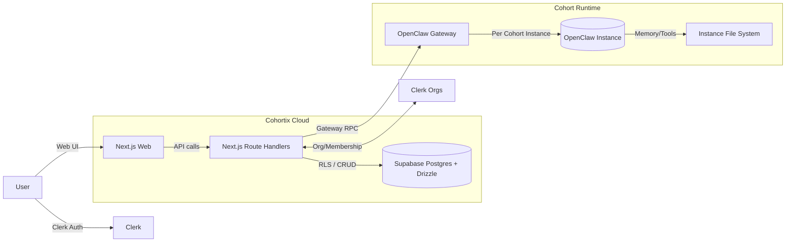
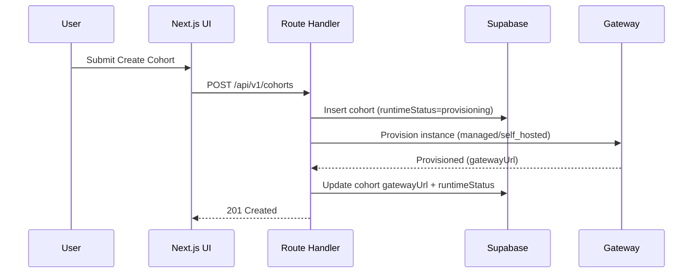
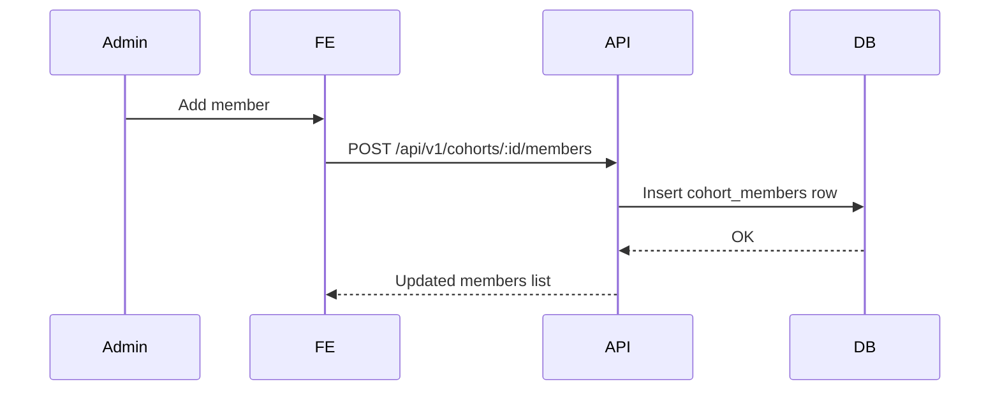
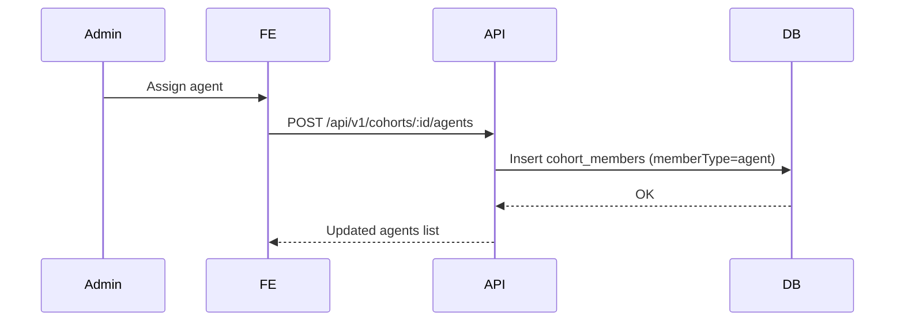
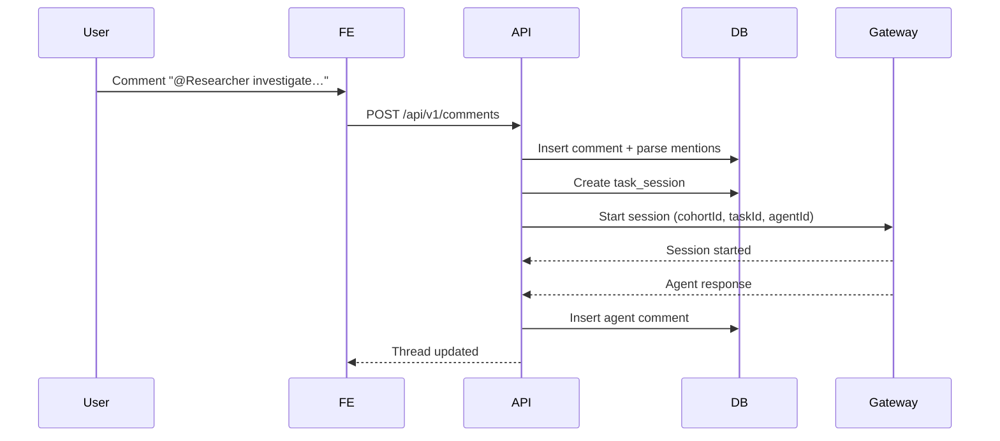

# System Design Document (SDD-002): Cohort Architecture

**Status:** Draft (post‑PRD approval) **Date:** 2026-02-27 **Owner:** Idris
(Architect) **Related:** [PRD-002](./PRD-002-cohort-architecture.md),
[ADR-002](../architecture/ADR-002-MULTI-INSTANCE-ARCHITECTURE.md), PRD.md,
COH‑B1 **Revised 2026-02-27:** Updated with PRD-002 input

---

## 1. Scope & Goals

**Goal:** Define the system design for Cohortix “Cohorts” as isolated OpenClaw
engine instances tied to users/orgs, with clear data scoping
(personal/cohort/org), cohort membership, and agent execution flows (tasks,
comments, sessions).

### 1.1 PRD Alignment (P0/P1 Coverage)

**P0 (Phase 1) in this SDD:** personal cohort provisioning, Clone foundation
onboarding, agent creation UI, task→agent assignment, @mention agent comments,
cohort dashboard (health/runtime/activity), AI model settings (BYOK), RLS scope
enforcement, per‑task session isolation, and schema changes (`cohorts`,
`cohort_members`, scoped PPV tables).

**P1 (Phase 2) in this SDD:** shared cohort provisioning, explicit organization
creation, Knowledge Hub (4-layer memory search), Agent Evolution Dashboard, My
Tasks aggregation, agent permissions, scheduled tasks UI (recurrence), skills
management per agent, and cohort activity feed.

### 1.2 Non‑Goals / Explicit Exclusions (from PRD)

- Mobile app, voice/video, custom LLM training, Notion RAG / MCP integrations,
  n8n workflow builder, billing/subscriptions, white‑label branding.
- Agent‑to‑agent communication across cohorts (hard boundary).
- Org admin access to personal cohorts (never).

---

## 2. System Context (Diagram)



---

## 3. Data Model & Schema Changes

### 3.1 Key Concepts

- **Personal Cohort:** exactly one per user; not tied to an org.
- **Shared Cohort:** belongs to an org; has members (users) and agents.
- **Scope Model:** every PPV entity has `scopeType` + `scopeId` (personal /
  cohort / org).
- **Membership:** users & agents assigned to cohorts with roles.

### 3.2 New/Updated Enums

```ts
export const cohortTypeEnum = pgEnum('cohort_type', ['personal', 'shared']);
export const cohortHostingEnum = pgEnum('cohort_hosting', [
  'managed',
  'self_hosted',
]);
export const cohortRuntimeStatusEnum = pgEnum('cohort_runtime_status', [
  'provisioning',
  'online',
  'offline',
  'error',
  'paused',
]);
export const cohortMemberRoleEnum = pgEnum('cohort_member_role', [
  'owner',
  'admin',
  'member',
  'viewer',
]);
export const scopeTypeEnum = pgEnum('scope_type', [
  'personal',
  'cohort',
  'org',
]);
export const cohortMemberTypeEnum = pgEnum('cohort_member_type', [
  'user',
  'agent',
]);
```

### 3.3 Cohorts Table (Update)

> Extends existing `cohorts` table to support personal/shared + hosting +
> runtime.

```ts
import {
  pgTable,
  uuid,
  varchar,
  text,
  timestamp,
  date,
  jsonb,
  integer,
  decimal,
  pgEnum,
} from 'drizzle-orm/pg-core';
import { organizations } from './organizations';

export const cohortTypeEnum = pgEnum('cohort_type', ['personal', 'shared']);
export const cohortHostingEnum = pgEnum('cohort_hosting', [
  'managed',
  'self_hosted',
]);
export const cohortRuntimeStatusEnum = pgEnum('cohort_runtime_status', [
  'provisioning',
  'online',
  'offline',
  'error',
  'paused',
]);

export const cohorts = pgTable('cohorts', {
  id: uuid('id').primaryKey().defaultRandom(),

  // Org association: NULL for personal cohorts
  organizationId: uuid('organization_id').references(() => organizations.id, {
    onDelete: 'cascade',
  }),

  // Personal/shared ownership
  type: cohortTypeEnum('type').default('shared').notNull(),
  ownerUserId: uuid('owner_user_id'), // set for personal cohorts only

  // Core fields
  name: varchar('name', { length: 255 }).notNull(),
  slug: varchar('slug', { length: 100 }).notNull(),
  description: text('description'),

  // Existing status (business/engagement)
  status: cohortStatusEnum('status').default('active').notNull(),

  // Runtime/hosting
  hosting: cohortHostingEnum('hosting').default('managed').notNull(),
  runtimeStatus: cohortRuntimeStatusEnum('runtime_status')
    .default('provisioning')
    .notNull(),
  gatewayUrl: text('gateway_url'),
  authTokenHash: text('auth_token_hash'),
  hardwareInfo: jsonb('hardware_info').default({}).notNull(),
  lastHeartbeatAt: timestamp('last_heartbeat_at', { withTimezone: true }),

  // Metrics (cached)
  memberCount: integer('member_count').default(0).notNull(),
  engagementPercent: decimal('engagement_percent', { precision: 5, scale: 2 })
    .default('0')
    .notNull(),

  // Dates
  startDate: date('start_date'),
  endDate: date('end_date'),

  // Audit fields
  createdBy: uuid('created_by').notNull(),
  createdAt: timestamp('created_at', { withTimezone: true })
    .defaultNow()
    .notNull(),
  updatedAt: timestamp('updated_at', { withTimezone: true })
    .defaultNow()
    .notNull(),

  // Optional settings
  settings: jsonb('settings').default({}).notNull(),
});
```

**Migration notes (SQL):**

- Add partial unique index: `unique (owner_user_id) where type='personal'`.
- Add check constraint:
  `(type='personal' AND organization_id IS NULL AND owner_user_id IS NOT NULL) OR (type='shared' AND organization_id IS NOT NULL)`.

### 3.4 Cohort Members (Users + Agents)

> Replace/extend existing `cohort_members` (currently agents only) to support
> users and agents.

```ts
import {
  pgTable,
  uuid,
  numeric,
  timestamp,
  unique,
  pgEnum,
} from 'drizzle-orm/pg-core';
import { cohorts } from './cohorts';
import { agents } from './agents';

export const cohortMemberRoleEnum = pgEnum('cohort_member_role', [
  'owner',
  'admin',
  'member',
  'viewer',
]);
export const cohortMemberTypeEnum = pgEnum('cohort_member_type', [
  'user',
  'agent',
]);

export const cohortMembers = pgTable(
  'cohort_members',
  {
    id: uuid('id').primaryKey().defaultRandom(),
    cohortId: uuid('cohort_id')
      .notNull()
      .references(() => cohorts.id, { onDelete: 'cascade' }),

    memberType: cohortMemberTypeEnum('member_type').notNull(),
    userId: uuid('user_id'),
    agentId: uuid('agent_id').references(() => agents.id, {
      onDelete: 'cascade',
    }),

    role: cohortMemberRoleEnum('role').default('member').notNull(),
    engagementScore: numeric('engagement_score', { precision: 5, scale: 2 })
      .default('0')
      .notNull(),

    joinedAt: timestamp('joined_at', { withTimezone: true })
      .defaultNow()
      .notNull(),
    updatedAt: timestamp('updated_at', { withTimezone: true })
      .defaultNow()
      .notNull(),
  },
  (table) => ({
    uniqueCohortMember: unique().on(
      table.cohortId,
      table.memberType,
      table.userId,
      table.agentId
    ),
  })
);
```

**Constraints (SQL):**

- `member_type='user'` ⇒ `user_id IS NOT NULL AND agent_id IS NULL`.
- `member_type='agent'` ⇒ `agent_id IS NOT NULL AND user_id IS NULL`.

### 3.5 Scope Columns (PPV Entities)

Add `scopeType` and `scopeId` to Visions, Missions, Operations, Tasks,
Knowledge, etc.

```ts
export const scopeTypeEnum = pgEnum('scope_type', [
  'personal',
  'cohort',
  'org',
]);

// Example: tasks
export const tasks = pgTable('tasks', {
  // ...existing columns
  scopeType: scopeTypeEnum('scope_type').default('personal').notNull(),
  scopeId: uuid('scope_id').notNull(),
  cohortId: uuid('cohort_id').references(() => cohorts.id, {
    onDelete: 'set null',
  }),
});
```

**Tables requiring scope fields (minimum):**

- `visions`, `missions`, `projects` (operations), `tasks`, `comments`,
  `knowledge_entries`, `insights`.

### 3.6 Agents (Personal + Shared)

Update `agents` to allow personal agents and cohort scoping:

- `organizationId` → nullable (only for shared agents)
- Add `ownerUserId` (for personal agents)
- Add `scopeType`, `scopeId` (personal/cohort/org)
- Add `defaultCohortId` (nullable; used for Clone)

**Constraints:**

- `scopeType='personal'` ⇒
  `owner_user_id IS NOT NULL AND organization_id IS NULL`.
- `scopeType='org'` ⇒ `organization_id IS NOT NULL`.

### 3.7 Comments & @Mentions (Agent Collaboration)

Update `comments` to support agent authors and @mentions:

- `scopeType`, `scopeId`, `cohortId` (align with scoped data model)
- `authorType` enum: `user|agent`
- `authorId` (user_id or agent_id)
- `mentionedAgentIds` uuid[] (parsed from @mentions)
- Optional `threadRootId` (for agent reply threading)

### 3.8 Activity Feed (Cohort-Scoped)

Update `activity_log` to support cohort/personal feeds:

- `scopeType`, `scopeId`, `cohortId`
- `actorType` enum: `user|agent`
- `actorId` (user_id or agent_id)

### 3.9 Model Settings & Skills Config

Use JSON-backed settings with secret references:

- `cohorts.settings.models` → allowed providers/models per cohort
- `agents.settings.modelPreference` → per-agent override (optional)
- `cohorts.settings.skills` → enabled skill ids
- Store API keys in Vault (Supabase Vault or external secrets); persist
  `secretRef` only.

### 3.10 Task Sessions (Isolation)

Add `task_sessions` (or `agent_runs`) to enforce per-task session isolation:

- `taskId`, `agentId`, `cohortId`, `scopeType`, `scopeId`
- `gatewaySessionId`, `status`, `startedAt`, `endedAt`, `error`

Each task execution creates a new session; no context bleed across tasks.

### 3.11 Clone Foundation Storage

Clone identity is stored inside the cohort runtime workspace (see ADR‑002):

- `clone-foundation/identity.md`
- `clone-foundation/values.md`
- `clone-foundation/decision-making.md`
- `clone-foundation/expertise.md`
- `clone-foundation/communication.md`
- `clone-foundation/aspirations.md`

UI writes to these files via Gateway RPC; summaries mirrored into
`agents.settings` for quick display.

### 3.12 Agent Evolution Events

Add `agent_evolution_events` to power the Evolution Dashboard:

- `agentId`, `cohortId`, `scopeType`, `scopeId`
- `eventType` (learning|correction|milestone)
- `summary`, `metadata`, `createdAt`

These events drive correction‑rate metrics and growth timeline.

---

## 4. API Design (Endpoints & Shapes)

### 4.1 Cohort Provisioning & Listing

**GET `/api/v1/cohorts`**

Query:

```json
{
  "type": "personal|shared",
  "organizationId?": "uuid",
  "status?": "active|paused|at-risk|completed"
}
```

Response:

```json
{
  "data": [
    {
      "id": "uuid",
      "name": "…",
      "type": "personal",
      "hosting": "managed",
      "runtimeStatus": "online"
    }
  ]
}
```

**POST `/api/v1/cohorts`**

Request:

```json
{
  "name": "Engineering",
  "type": "shared",
  "organizationId": "uuid",
  "hosting": "managed|self_hosted",
  "settings": {}
}
```

Response:

```json
{ "data": { "id": "uuid", "runtimeStatus": "provisioning" } }
```

**POST `/api/v1/cohorts/personal/provision`** (signup only)

Request:

```json
{ "userId": "uuid", "defaultName": "Ahmad's Cohort" }
```

Response:

```json
{ "data": { "id": "uuid", "type": "personal" } }
```

### 4.2 Membership Management

**GET `/api/v1/cohorts/:id/members`**

Response:

```json
{ "data": [{ "memberType": "user", "userId": "uuid", "role": "admin" }] }
```

**POST `/api/v1/cohorts/:id/members`**

Request:

```json
{ "memberType": "user", "userId": "uuid", "role": "member" }
```

Response:

```json
{ "data": { "id": "uuid" } }
```

**DELETE `/api/v1/cohorts/:id/members/:memberId`**

Response:

```json
{ "success": true }
```

### 4.3 Agent Assignment

**POST `/api/v1/cohorts/:id/agents`**

Request:

```json
{ "agentId": "uuid", "role": "member" }
```

Response:

```json
{ "data": { "cohortId": "uuid", "agentId": "uuid" } }
```

**DELETE `/api/v1/cohorts/:id/agents/:agentId`**

Response:

```json
{ "success": true }
```

### 4.4 Cohort Runtime / BYOH

**POST `/api/v1/cohorts/:id/start`**

```json
{ "mode": "managed|self_hosted" }
```

**POST `/api/v1/cohorts/:id/stop`**

```json
{ "reason": "idle" }
```

**POST `/api/v1/cohorts/:id/connection-token`**

Response:

```json
{ "data": { "token": "opaque", "expiresAt": "ISO" } }
```

**POST `/api/v1/cohorts/:id/heartbeat`** (called by gateway)

Request:

```json
{ "runtimeStatus": "online", "hardwareInfo": { "os": "macOS" } }
```

Response:

```json
{ "success": true }
```

### 4.5 Agent Management (Creation + Clone)

**POST `/api/v1/agents`**

```json
{
  "name": "Idris",
  "scopeType": "personal",
  "scopeId": "userId",
  "defaultCohortId": "uuid",
  "settings": {}
}
```

**PATCH `/api/v1/agents/:id`**

```json
{ "status": "active", "settings": { "modelPreference": "gpt-4.1" } }
```

**GET `/api/v1/agents/:id/evolution`**

```json
{ "data": [{ "eventType": "learning", "summary": "…" }] }
```

### 4.6 Task Execution & @Mentions

**POST `/api/v1/tasks/:id/assign`**

```json
{ "assigneeType": "agent", "assigneeId": "uuid" }
```

**POST `/api/v1/comments`** (agent mentions trigger session)

```json
{
  "entityType": "task",
  "entityId": "uuid",
  "authorType": "user",
  "content": "@Researcher please investigate…"
}
```

**POST `/api/v1/task-sessions`** (internal)

```json
{ "taskId": "uuid", "agentId": "uuid" }
```

### 4.7 Model Settings & Skills

**PUT `/api/v1/cohorts/:id/settings/models`**

```json
{ "allowedModels": ["gpt-4.1", "claude-3.7"], "secretRef": "vault:key:openai" }
```

**PUT `/api/v1/agents/:id/settings/skills`**

```json
{ "enabledSkills": ["web-search", "summarize"] }
```

### 4.8 Knowledge Hub

**GET `/api/v1/knowledge/search`**

```json
{ "query": "pricing strategy", "cohortId": "uuid" }
```

Aggregates built‑in memory + Mem0 + Cognee + QMD by cohort scope.

### 4.9 My Tasks Aggregation

**GET `/api/v1/tasks/my`**

```json
{ "userId": "uuid", "includePersonal": true, "includeShared": true }
```

### 4.10 Organization Creation (Explicit)

**POST `/api/v1/organizations`**

```json
{ "name": "Acme", "slug": "acme" }
```

---

## 5. Component Architecture (React Tree)

```
/app
  /onboarding
    page.tsx
  /my-tasks
    page.tsx
  /knowledge
    page.tsx
  /agents
    /[id]
      page.tsx
  /[orgSlug]
    /cohorts
      page.tsx
      /[id]
        page.tsx
    /settings
      /models
        page.tsx
      /skills
        page.tsx
/components
  /cohorts
    CohortsTableClient
      CohortsTable
        CohortRow
    CohortHeader
    CohortDashboard
    CohortMembersPanel
      MemberRow
      AddMemberDialog
    CohortAgentsPanel
      AgentRow
      AssignAgentDialog
    CohortRuntimePanel
      RuntimeStatusChip
      ConnectionTokenCard
      HeartbeatHistory
    CohortActivityFeed
  /agents
    AgentProfile
    AgentEvolutionTimeline
    AgentSkillsPanel
    AgentModelSettings
    AgentCreateDialog
  /tasks
    MyTasksTable
    TaskAssignDialog
    TaskRecurrenceEditor
  /knowledge
    KnowledgeSearch
    KnowledgeSourcesPanel
```

**New components for cohort architecture:**

- `OnboardingCloneFlow` (Clone foundation questions + starter tasks)
- `CohortDashboard` (health status, runtime controls, activity)
- `CohortRuntimePanel` (runtime status, hosting type, connect token)
- `CohortMembersPanel` (user membership + roles)
- `CohortAgentsPanel` (agents assigned to cohort)
- `CohortActivityFeed` (agent actions audit trail)
- `AgentEvolutionTimeline` (learning/corrections over time)
- `KnowledgeSearch` (4‑layer memory search)
- `MyTasksTable` (cross‑cohort aggregation)
- `TaskRecurrenceEditor` (cron/scheduled tasks)

---

## 6. Data Flow Diagrams (Key Flows)

### 6.1 Cohort Creation (Shared)



### 6.2 Member Management



### 6.3 Agent Assignment



### 6.4 Task Execution via @Mention



---

## 7. Security Model (RLS & Permissions)

### 7.1 RLS Policies (Examples)

```sql
-- Cohorts: personal
CREATE POLICY cohort_personal ON cohorts
  FOR ALL USING (type = 'personal' AND owner_user_id = auth.uid());

-- Cohorts: shared
CREATE POLICY cohort_shared ON cohorts
  FOR ALL USING (
    type = 'shared' AND id IN (
      SELECT cohort_id FROM cohort_members
      WHERE member_type = 'user' AND user_id = auth.uid()
    )
  );

-- Cohort members: only cohort members can see
CREATE POLICY cohort_members_access ON cohort_members
  FOR ALL USING (
    cohort_id IN (
      SELECT cohort_id FROM cohort_members
      WHERE member_type = 'user' AND user_id = auth.uid()
    )
  );

-- Scoped content (tasks example)
CREATE POLICY tasks_personal ON tasks
  FOR ALL USING (scope_type='personal' AND scope_id = auth.uid());

CREATE POLICY tasks_cohort ON tasks
  FOR ALL USING (scope_type='cohort' AND scope_id IN (
    SELECT cohort_id FROM cohort_members WHERE member_type='user' AND user_id = auth.uid()
  ));

CREATE POLICY tasks_org ON tasks
  FOR ALL USING (scope_type='org' AND scope_id IN (
    SELECT organization_id FROM organization_memberships WHERE user_id = auth.uid()
  ));
```

### 7.2 Permission Model

- **Personal cohort:** only owner; org admins have zero visibility (hard
  boundary).
- **Shared cohort:** roles `owner/admin/member/viewer`.
- **Agent actions:** limited by cohort role + per‑agent permissions
  (read/write/admin per action type) and skill allow‑list.
- **Model access:** constrained by cohort allowed models + BYOK secret refs.
- **Admin overrides:** never allowed on personal scope.
- **Cross‑cohort communication:** disallowed (agents cannot access other
  cohorts’ data or sessions).

---

## 8. Migration Strategy

1. **Add enums + columns** (cohorts: type/hosting/runtime; scoped fields on PPV
   entities).
2. **Extend tables**
   - `agents`: add personal scoping fields.
   - `comments`: add scope + authorType/authorId + mentions.
   - `activity_log`: add scope + actorType/actorId.
   - Add `task_sessions` (or `agent_runs`).
3. **Backfill**
   - Create personal cohort for each existing user.
   - Assign all existing org cohorts as `shared`.
   - Set `scopeType='org'` and `scopeId=organization_id` for legacy records.
4. **Update RLS** to enforce new scope model.
5. **Update API handlers** for new cohort types, membership, sessions, and agent
   creation.
6. **Progressive UI rollout** (feature flag: `cohort-architecture-v2`).

---

## 9. Integration Points

- **Clerk:** user/org identity, org membership. On signup, webhook provisions
  personal cohort and writes `profiles` row.
- **Supabase:** primary DB with RLS; service role for provisioning; Vault for
  BYOK secrets.
- **Existing hooks:** `useCohorts`, `useCohortDetail`, `useCohortMembers`
  extended to include `type`, `hosting`, `runtimeStatus`, `members`.
- **OpenClaw Gateway:** provision, heartbeat, session routing; task session
  start/stop.
- **Memory stack:** built‑in markdown memory + Mem0 + Cognee + QMD (scoped by
  cohortId).
- **Skills registry:** cohort/agent settings drive allowed skill list.

---

## 10. Open Questions / TODO

- Decide whether to split cohort membership into two tables (users vs agents) vs
  unified `cohort_members`.
- Determine lifecycle rules for `runtimeStatus` when self‑hosted instance
  disconnects.
- Decide default names for personal cohorts ("<FirstName>'s Cohort").
- Clone foundation depth: number of onboarding questions and editable fields.
- BYOH minimum specs + automated compatibility checks.
- Marketplace versioning + update delivery model (opt‑in vs auto).

---

## 11. Appendix — Existing Code Touchpoints

- `packages/database/src/schema/cohorts.ts`
- `packages/database/src/schema/cohort-members.ts`
- `packages/database/src/schema/tasks.ts`
- `apps/web/src/app/api/cohorts/*`
- `apps/web/src/hooks/use-cohorts.ts`
- `apps/web/src/components/cohorts/*`
